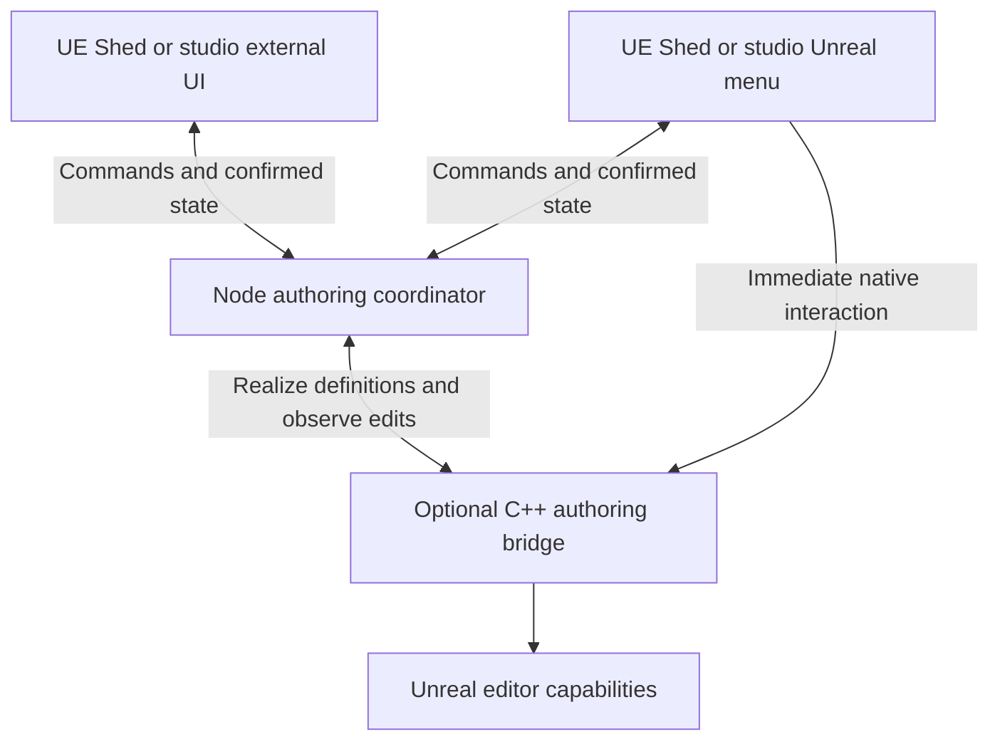

# A modular authoring synchronization layer

Concept recorded 2026-09-10. This is a proposed direction, not a shipped capability or an
implementation commitment. A general synchronization library remains outside the camera-authoring
feature's scope. That feature should establish the public interfaces and implement only the bounded
synchronization required for its own workflow.

## Purpose and scope

An Unreal menu and an external tool should be able to edit the same authoring session without each
implementing pending-edit tracking, acknowledgements, retries, and reconciliation. Studios can use
UE Shed's menus, replace them, or operate through public packages and the CLI. Neither UI is the
authority merely because it presents the controls.

The first example is camera authoring: generate an actor's camera set externally, move a camera in
Unreal, choose an actor to hide in one view, and see the same confirmed definition in both interfaces.
Framing, actor scope, and visibility policy belong to the camera domain. A future shared layer owns
the synchronization mechanics around domain commands.

This follows the [headless-first architecture](../vision-and-architecture.md) and
[agent operation and adoption requirements](../engineering/agent-adoption.md).

[TanStack DB](https://tanstack.com/db/latest/docs/overview) provides architectural precedent: a
reactive client view over synced collections with optimistic mutations separate from confirmed data
and integrations for different data sources. It is a reference for the separation of concerns.
No TanStack DB dependency is proposed, nor a commitment to reproduce its database features or embed
a TypeScript runtime in Unreal.

The intended direction is a UE Shed-specific library for stable identities, scoped subscriptions,
pending commands, confirmed changes, and reconnect/reconciliation semantics. Arbitrary queries,
joins, indexing, incremental query execution, CRDTs, and offline multi-writer merging are much larger
projects and are not prerequisites. Build the camera-specific minimum first; extract a wider library
after a second concrete workflow validates the common boundary. Generic package/plugin names and
third-party implementation choices remain undecided.

## Node coordinator and native clients

The proposed coordinator runs in **Node**, as a public TypeScript service hosted by the CLI,
Workbench's main process, or a studio-owned host. It is not necessarily a separate daemon and does
not require a cloud service. Effect owns TypeScript workflows, resources, concurrency, and typed
failures; pure domain transformations remain ordinary functions.

This is logical state flow, not a separate socket for each arrow. There is one logical coordinator
per authoring session. Another host attaches to that owner rather than becoming a second authority.
Owner discovery, leases, and restart fencing must be defined before concurrent hosts are supported.
Separate sessions writing the same durable document still require revision checks and storage-level
serialization.

Unreal has two roles: its menu is a client of the authoring document, while the editor is the
authority over the live world. Keep those roles explicit:

| State                                                                                | Authority                                              |
| ------------------------------------------------------------------------------------ | ------------------------------------------------------ |
| Arrangement definitions, approved poses, exclusions, document revisions              | Node-hosted domain service and durable repository      |
| Existing actors, actual transforms, loaded world, viewport ownership, render results | Unreal editor capabilities                             |
| Hover, expanded panels, presentation-local selection                                 | Each UI                                                |
| Unacknowledged edits and immediate native camera movement                            | Pending intent, distinct from confirmed document state |

The host owns intended definitions; Unreal reports what exists and what was applied. A durable
commit does not prove successful realization or rendering. Report those outcomes separately.

Full authoring requires the Node host even when using only the Unreal menu. Native movement can
remain immediate during a temporary disconnect, but confirmation and saving require the host.
Fully standalone Unreal authoring without Node would require a different authority design.

## Separately enabled bridge and menu

The proposed camera-specific split is:

| Plugin                        | Responsibility                                                                                                 | Dependency                    |
| ----------------------------- | -------------------------------------------------------------------------------------------------------------- | ----------------------------- |
| `UEShedCameras`               | Existing camera/rendering capabilities, scoped capture intervention, public engine primitives                  | Existing Core dependency      |
| `UEShedCameraAuthoringBridge` | Optional transient authoring proxies, selection/piloting integration, editor events, synchronization with Node | `UEShedCameras`               |
| `UEShedCameraAuthoring`       | Optional first-party menu, panel, Details customizations, public client wiring                                 | `UEShedCameraAuthoringBridge` |

The new plugins are proposed, not implemented. The bridge is independently opt-in; existing camera
and capture consumers do not have to adopt it. Capturing approved definitions continues to need only
the existing capture capabilities. Dependencies run menu → bridge → Cameras and never reverse.

A studio can install our menu, build its own using the public bridge, or supply its own native
adapter implementing the versioned protocol. The package and protocol must not require first-party
menu names, widget paths, or private UObject endpoints. Provide public native helpers and
capability-discovered entry points.

C++ exchanges language-neutral commands, events, and snapshots with an external host running
`@ue-shed/cameras`; it does not import that TypeScript package directly. Each language gets an
idiomatic client facade with the same observable semantics. Slate objects, Solid signals, vendor
collection types, and widget events do not appear in the wire contract.

## Transport boundary

**`unreal-rc` is the existing UE Shed-owned Remote Control client/transport library.** It predates
UE Shed and is consumed through `@ue-shed/unreal-connection`. Use it for Remote Control communication
rather than adding a competing HTTP/WebSocket client. Its repository ownership, monorepo placement,
and npm naming are separate maintenance decisions; this document does not change them.

| Layer                                        | Owns                                                                                    |
| -------------------------------------------- | --------------------------------------------------------------------------------------- |
| `unreal-rc`                                  | General Remote Control requests, responses/events, and transport lifecycle              |
| `@ue-shed/unreal-connection`                 | UE Shed connection and companion-capability adapters                                    |
| Sync client/coordinator                      | Pending commands, confirmed document changes, acknowledgement, ordering, reconciliation |
| Domain package, initially `@ue-shed/cameras` | Command meaning, validation, framing, policy, approval, persistence rules               |
| Native bridge                                | Applying definitions, observing native edits, scoped editor resource ownership          |
| Menus                                        | Presentation and mapping user actions to public commands                                |

The existing Remote Control request path is initiated by the TypeScript host. Logical bidirectionality
does not require Unreal to call an HTTP server in Node: the native bridge can expose a bounded queue
of user commands/events that the host reads and acknowledges through Remote Control. The host sends
confirmed state back through that same client. A future verified push implementation can replace
polling behind the port; no second callback server is required just to connect these clients.

Transport reconnection or request receipt does not prove document consistency or durable commit.
A timed-out mutation may already have executed. Keep request correlation separate from durable
operation identity, and use domain idempotency/recovery instead of blind transport retries.

## Public synchronization ports

Names below describe semantics, not frozen APIs. Scope is domain-defined and explicit. For cameras,
project, map, actor, and arrangement identify the active set. A multi-actor Review Set is not the
scope of shared camera tuning. Reject mixed-membership commands rather than affecting other actors.

| Port                          | Required semantics                                                                                                     |
| ----------------------------- | ---------------------------------------------------------------------------------------------------------------------- |
| `open(scope)`                 | A consistent snapshot, matching change cursor, authority epoch, schema/capability versions                             |
| `changes(scope, afterCursor)` | Bounded ordered atomic batches with stable IDs, upserts/deletions, commit identity, origin, causing operation IDs      |
| `submit(command)`             | Domain intent, stable operation ID, expected revisions, explicit scope; rejected, pending, or durably committed result |
| `operation(operationId)`      | Recover an indeterminate outcome; distinguish unknown/expired from known rejection or commit                           |
| `observe(scope)`              | Reactive local read model, pending edits, confirmed revision, sync/conflict status                                     |
| `close(scope)`                | Release subscriptions and owned resources while exposing unsettled operations                                          |

An adapter submits domain commands; it must not update raw camera rows around domain validation.
Regenerating a group can change the arrangement and several cameras. Publish that result atomically,
with stable camera identities, manual-pose exceptions, and actor membership intact.

Acquire the snapshot and cursor consistently. Replay all changes after it or explicitly require a
reset. Define retention, epoch changes, duplicate batches, ordering gaps, and expired cursors.
A reset replaces confirmed state and reconciles pending intent without silently discarding edits.
Distinguish the coordinator's document epoch from Unreal's producer/world epoch when they restart
independently. Bounded polling is a valid initial implementation; no generic query language,
unbounded event log, or database replication is required.

Correlate command responses and change-feed echoes by operation/commit identity. Retire the pending
overlay only when matching confirmed state is installed, whether supplied in the response or a
change batch. Either delivery order must avoid flicker, duplicate application, and stuck pending
state. The flow is commands in and confirmed state out, not unrestricted mutation of two copies.

## Editing and state categories

For native camera movement:

1. Unreal moves the transient camera immediately through its normal controls.
2. The native facade records pending intent and coalesces intermediate pose samples.
3. A completed gesture submits a command with scope, revision, and operation identity.
4. The coordinator validates and durably commits the draft, then publishes the change.
5. Both clients reconcile. Unreal confirms the movement instead of applying it again; an old
   acknowledgement must not overwrite a newer active gesture.

For an external shared-FOV edit, the coordinator computes and commits the resulting camera
definitions, then the bridge realizes them in Unreal. Keep realization failures distinct from
document persistence. Scope the change to the actor's explicitly chosen arrangement, even when
other arrangements use the same recipe.

Separate three state categories:

- **Confirmed document state:** definitions, revisions, visibility rules, and explicit deletion.
  An autosaved draft is not an approved Review Set; approval remains a separate domain command.
- **Pending intent:** optimistic display or native edits awaiting confirmation. Stale/rejected
  commands need visible recovery rather than last-writer-wins or blind replay.
- **Ephemeral editor state:** gesture samples, selection snapshots, pilot ownership, and live frames.
  Final poses become document commands. Image bytes never enter document replication. Select,
  pilot, and capture are engine operations with their own lifecycle, not replayable row updates.

Short per-camera gesture ownership can make conflicting batch edits wait or return busy. Both menus
use the same scope, revisions, and approval semantics. Ordinary UI selection is distinct from an
explicit request to change Unreal's editor selection.

Expose Editing locally, Syncing, Draft saved, Conflict, and Disconnected states. Bound queues,
in-flight operations, retries, and preview work. Measure acknowledgement latency, queue pressure,
resets, and recovery outcomes without high-cardinality actor labels in metrics. Polling cadence
alone does not demonstrate responsiveness.

## Recovery and resource ownership

Idempotency needs a declared retention window and recoverable operation record. After a lost
response, query the same identity; do not mint another identity and retry blindly. Approval needs
recovery between durable document save and session status update so a crash cannot append duplicate
Views. Competing writers need revision validation under a lock or equivalent transactional storage
policy; an atomic rename alone cannot prevent lost updates.

The native bridge keeps a bounded unacknowledged buffer while its ownership lease is valid. Expose a
recovery patch before lease expiry releases editor resources. An editor crash may lose an
unacknowledged gesture; never label it saved. Reconnect reconciles identities, epochs, revisions,
and pending commands before applying anything to a replacement editor session.

The bridge owns transient proxies and its viewport interaction. Map changes, PIE, viewport loss,
shutdown, and lease expiry release owned state. Piloting and capture cannot race for a viewport.
Restoration must not overwrite unrelated changes after deliberate release of ownership. Native
Undo/Redo, map cleanliness, autosave, and proxy lifetime need actual Unreal evidence; generic sync
does not replace engine-specific cleanup or transaction behavior.

## Adoption and acceptance

Ship an adoption guide, neutral schemas and compatibility policy, minimal native custom-menu
example, dependency metadata, and a clean-consumer conformance runner. First-party menus must use
exactly the public interfaces offered to studios.

Disable `UEShedCameraAuthoring` and remove Workbench. A minimal studio-style menu using the optional
bridge and a public-package host must create an arrangement, edit from both clients, assign
exclusions, synchronize, save, reopen, and capture. Existing capture-only consumers must work without
either authoring plugin.

The camera implementation should prove:

- consistent snapshot/bootstrap, ordered delivery, duplicate suppression, deletion, cursor reset;
- atomic multi-camera changes and response/change-feed arrival in either order;
- lost-response recovery, rejection, conflicts, restart fencing, and epoch changes;
- bounded queues and reliable final gestures without menu-owned reconciliation code;
- isolation of other actors and arrangements in the same Review Set;
- substitution through public ports using a small test adapter, with no private imports;
- native cleanup and truthful saved/applied/captured outcomes.

No second production sync provider is required to prove the interface. Shared sync infrastructure,
independent offline writers, generalized queries, and automatic merging remain future work. The
camera feature can finish with a minimal implementation behind these ports; it must not wait for
a general database or synchronization platform.
