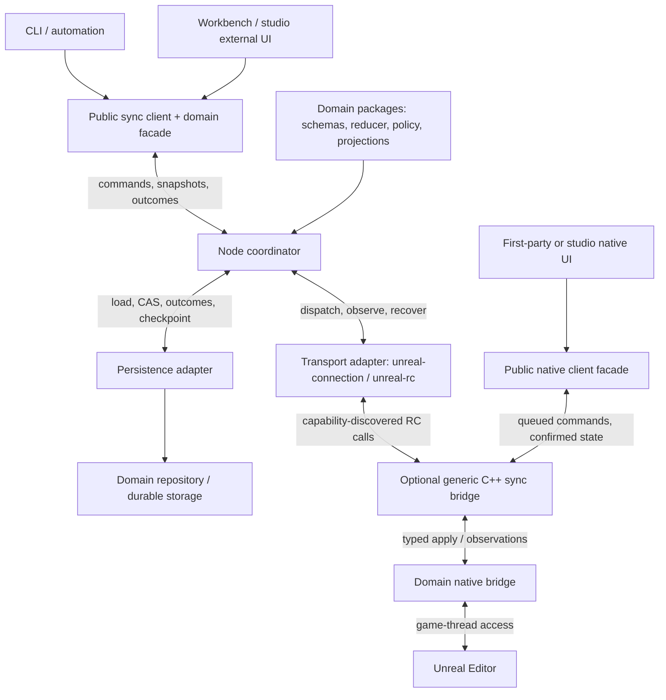

# A modular authoring synchronization layer

This develops the concept recorded 2026-09-10 in place. New protocol/package names are proposals,
not shipped promises. Implementation status and the review boundary live in the
[implementation plan](../../plans/standalone-sync.md).

The reusable unit is a **single-authority, revisioned command coordinator with a scoped client read
model**: command identity, serialization, pending intent, outcome recovery, latest-snapshot subscriptions,
resynchronization and fenced engine dispatch. Domains supply command meaning and persistence policy;
adapters supply storage and transport. The next package supplies its reducer and ports instead of
writing another polling/reconciliation loop.

## Direction revision (2026-10-09)

This revision restates the goal and supersedes the sections below where they conflict. Those
sections, the HTML reading edition and the [implementation plan](../../plans/standalone-sync.md)
still describe the 2026-10-02 coordinator-centric design. The direction stays parked: it is a large
undertaking and no implementation is authorized.

### Goal: editing in UE Shed is editing in Unreal

The layer is worth building only if it makes UE Shed feel like editor tooling. An edit in UE Shed
mutates the editor's in-memory objects immediately: packages become dirty and the edit is one entry
on Unreal's undo stack. An edit made in Unreal (Details panel, asset editors, Undo/Redo, scripts)
appears in UE Shed. Saving stays a separate, explicit step because it is separate in Unreal. One UE
Shed edit that touches five DataTables mutates those five tables in Unreal as one transaction.

### TanStack DB model, applied properly

TanStack DB is the precedent for the interaction model, not only the read model:

- Clients read and write local collections synchronously. A mutation shows at once as an optimistic
  overlay over confirmed state.
- Persistence, transport and confirmation are the engine's job. Users do not perform "write, then
  sync" steps; those become the mutation's status.
- Failure is a mutation state. A rejected mutation rolls its overlay back with a reason. Success means
  the authority's state arrives and the overlay retires.
- Deliberate checkpoints are transactions held open until an explicit commit, not workflow steps.

Status replaces steps. A translation edit, for example, reads as `pending`, `written to PO`, `synced
into Unreal`, `rejected: stale` or `blocked: check out <file>`, while the line already shows the new
text.

| Step                                                | Classification                                                      |
| --------------------------------------------------- | ------------------------------------------------------------------- |
| Persisting a pending edit and showing it to clients | Engine plumbing                                                     |
| Applying an edit to the editor's in-memory objects  | Engine plumbing                                                     |
| Headless PO write                                   | Engine plumbing; may be blocked because UE Shed never checks out    |
| Unreal localization import/compile                  | Engine plumbing, batched and debounced because it is a slow process |
| Saving packages                                     | Explicit decision, as in Unreal                                     |
| Reviewing a change set before it is written         | Explicit decision today; could become team policy                   |
| Camera approval and Review Set publication          | Explicit decision                                                   |

Which explicit decisions may become team policy (for example writing translations without a staged
review) is a product decision recorded in the owning docs and ADRs, not an engine decision.

### Authority and topology

- **The editor is the authority** for native resources: its in-memory objects own revisions and
  outcomes while it is connected. Unreal's transactions and dirty packages replace a UE Shed-owned
  durable draft store during live editing.
- **Node is a relay**: fan-out to multiple clients, caching, reconnect and resynchronization, and the
  offline fallback. It does not become a second authority over native resources.
- **Every tier has the same shape** (a client of its upstream, a synchronous optimistic view for its
  downstream), but **only the authority confirms**. Relays forward commands with the original
  mutation ID and forward snapshots unchanged. The same end-to-end mutation ID resolves at every tier,
  so optimism does not stack and retries stay at-most-once at the authority.
- **Undo is Unreal's undo.** The editor's undo stack is global, so undo from UE Shed may undo an edit
  made in another editor window. That is ordinary editor behavior. Data Authoring's own draft
  undo/redo remains for offline mode.
- **Offline behavior is open**: read-only over saved packages, or the existing draft session replayed
  as one Apply when an editor connects.

### What already exists

`UUEShedAuthoringLibrary::Apply` in the `UEShedAuthoring` plugin is the write half of the authority
for DataTables. It checks each table's fingerprint against live state and rejects stale plans, wraps
every table in one `FScopedTransaction` (one undo entry), cancels the transaction and restores
backups if any command fails, caches results by operation ID (`LookupApplyResult`), and returns table
snapshots. Today it runs once at the end of a draft session; live editing runs it per edit or short
batch.

The reverse stream has engine hooks in both UE 5.7 and UE 5.8 (checked against each engine's
`Engine/Source` on 2026-10-09): `FCoreUObjectDelegates::OnObjectTransacted`,
`OnObjectPropertyChanged` and `OnObjectModified`; `UDataTable::OnDataTableChangedDelegate`;
`FEditorUndoClient::PostUndo`/`PostRedo`; and `UPackage::PackageDirtyStateChangedEvent`.
`FOnDataTableChanged` is a thread-safe multicast delegate in 5.8 and an ordinary one in 5.7. Observed
changes must suppress echoes of UE Shed's own transactions. Other supported engines are unverified.

### Engine split

- **Client side, target-agnostic**: optimistic overlay, mutation IDs and status, subscriptions,
  relay, reconnect and framework adapters such as Solid.
- **Authority adapter, editor-shaped from day one**: `apply(mutation)` returning an outcome and
  snapshot, `observe()` returning a change stream, fingerprints or revisions chosen by the adapter,
  and optional dirty-state and undo hooks.
- **Generic C++ bridge**: transaction wrapping, fingerprints, operation-ID cache, observation, echo
  suppression and dirty tracking, extracted from what `UEShedAuthoring` already does for DataTables.
  Domains register object kinds (DataTable rows, camera actors, text properties, String Tables).
- **Shared outcome vocabulary and operation journal**, useful without any live client: one outcome
  union (`committed`, `rejected_stale`, `partial`, `indeterminate`), receipts with recovery guidance,
  and record-intent/run/record-outcome/reconcile. Data Authoring's
  `prepareApply`/`markApplyIndeterminate`/`completeApply`/`reconcileApply` and camera projection
  recovery already hand-roll this; localization's `partially_written` cannot be resumed today.

Commands stay domain-typed. The engine does not merge, does not offer generic JSON patches, and does
not provide multi-authority transactions; domain validation and policy stay in domains.

### Consumers

| Domain         | Live fit                                                    | Notes                                                                                           |
| -------------- | ----------------------------------------------------------- | ----------------------------------------------------------------------------------------------- |
| Data Authoring | Full: DataTables are editor objects                         | Apply already provides the transaction, fingerprint check, rollback and operation cache         |
| Localization   | Source text and key fixes in assets and String Tables: full | Translations live in archives and PO files, so they stay a file-backed collection with a status |
| Camera         | Already live through its bridge                             | Moves onto the shared bridge; its arrangement store is one adapter, not the model               |

Localization needs from its plans: staged edits that survive a Workbench restart and are visible to
the CLI and agents (deferred in archived Plan 051), the Level 3 editor writer, a faster
Unreal-to-writing round trip (Plan 052's interview deliverables), key fixes applied in Unreal (ADR
0009 addendum), and review edits that serialize instead of refusing concurrent local writers.

### First target

Camera was chosen first because UE Shed controls both of its interfaces, which keeps the protocol
testable without fighting Unreal's own editors. It is not the final vision, and it hides the hard
parts: a UE Shed-owned document makes Node the natural authority, cooperative panels never require
inferring mutations from transaction events, and there is no dirty state or undo to mirror. Use camera
to prove the client side only. While doing so, sketch the DataTable adapter against the authority
interface; if the interface cannot express `Apply` and the observation hooks above, it is
camera-shaped and must change.

The alternative first target is a live Data Authoring spike: edit one cell in Workbench and see it in
Unreal's DataTable editor, edit in Unreal and see it in Workbench, and undo from either side. It is
about as small as camera's first slice and exercises the real authority model.

### Open questions

- Offline mode: read-only, or a draft session replayed on connect.
- Which explicit decisions may become team policy.
- Whether translations become live objects through the Level 3 editor writer.
- Whether camera arrangements stay UE Shed-owned or move into Unreal-owned data.
- Engine coverage for the bridge beyond UE 5.7 and UE 5.8.

## Standing boundaries and recommendations

| Standing boundary                                                                          | Basis                                                                                                                                |
| ------------------------------------------------------------------------------------------ | ------------------------------------------------------------------------------------------------------------------------------------ |
| Libraries and CLI are first-class; Workbench and native menus are clients                  | [Architecture](../vision-and-architecture.md), [engineering](../engineering/README.md), [adoption](../engineering/agent-adoption.md) |
| Language-neutral contracts, validation, optional capability-discovered plugins             | Architecture and [types/errors](../engineering/types-and-errors.md)                                                                  |
| UE Shed-owned `unreal-rc` remains the Unreal transport behind `@ue-shed/unreal-connection` | Architecture and original concept; no repository move or release-ownership change                                                    |
| Placement, inheritance, culling, approval merging and capture policy stay in cameras       | Existing camera domain and this design's scope                                                                                       |

Recommendations for review, not previously accepted architecture decisions:

- Retain Node coordination: one active owner per document, embedded in a CLI or studio host if
  desired. No mandatory daemon, cloud service or native TypeScript runtime.
- Propose `@ue-shed/sync` with browser-safe client and Node coordinator exports; neutral wire schemas
  and fixtures live under `packages/protocol/contracts/sync/v1`.
- Propose optional `UEShedSyncBridge` for C++ queues, fences, outcomes, subscriptions and lease
  plumbing. Domain bridges register typed apply/observation handlers. Generic bridge depends on
  Core; camera bridge depends on it and Cameras; menus use public facades. Rendering stays independent.
- V1 uses strict document compare-and-swap (CAS), full snapshots and explicit operation recovery.
  Prove extraction with cameras plus a tiny unrelated fixture domain before publication. This
  refines the original “second workflow before wider extraction” sequencing: the fixture proves
  independence; another production workflow must justify broader APIs.
- Durable domains commit before publishing acceptance. Volatile domains advertise volatile
  acceptance. Neither equates acceptance with engine application or domain approval.

TanStack DB motivated the reactive read-model discussion. V1 neither adopts it nor builds a database,
query language, joins, indexes, CRDTs, arbitrary JSON merging, offline multi-master editing, automatic
cross-host failover or distributed lock service. Support multiple online clients, one coordinator
per document, one attached editor binding per session and explicit editor replacement. Independent
documents run concurrently. Names and defaults remain subject to review.

## Evidence from camera flow

Rechecked `feat/camera-flow` at `f7e6dec` on 2026-09-13 with a clean source worktree. These are source
and test observations, not a fresh claim that live gates pass. Paths below refer to that revision;
the concept branch does not contain the later camera implementation.

| Source at that revision                                                                           | Extraction lesson                                                                                                                                                                                                   |
| ------------------------------------------------------------------------------------------------- | ------------------------------------------------------------------------------------------------------------------------------------------------------------------------------------------------------------------- |
| `packages/cameras/src/camera-arrangement.ts` and `.test.ts`                                       | Stable camera/View IDs, scope/revision checks, pure commands, exceptions and retired identities remain domain behavior.                                                                                             |
| `packages/cameras/src/camera-authoring-store.ts`: `mutate`, `prior`                               | Outcomes/fingerprints commit with documents; its 256-entry history needs explicit expiry/retry semantics.                                                                                                           |
| Same file: `cameraApprovalBase`, `recoverProjection`, `approve`                                   | Owned-view approvals are domain-aware. Projection intent repairs interrupted export. Source/destination are separately locked, not one atomic transaction; concurrent cross-document publication needs conformance. |
| `packages/cameras/src/camera-authoring-bridge.ts`: `synchronizeArrangementCamera`                 | Producer/sequence checks stop old acknowledgements overwriting continued movement. Intervening host edits conflict; two-way traffic does not create equal authority.                                                |
| `packages/cameras/src/camera-authoring-panel.ts`: `tick`, `processEvent`                          | Load/import/recover/approve/activate/republish orchestration mixes mechanics with panel actions. Extract mechanics, retain domain actions/projections.                                                              |
| `UEShedCameraAuthoringBridge.cpp`: `Observe`, `Execute`, `Shutdown`                               | Observing actual proxy transform/FOV catches edits outside menus. Game-thread checks, 30-second lease, transient proxies and recovery-file attempts exist; unacknowledged gestures are not crash-durable.           |
| `SCameraArrangementPanel.cpp`: `Refresh`, `RebuildCameras`                                        | Revision/approval-sensitive refresh improves on ID-only refresh, but rebuilding rows can disturb focus. Stable subscriptions should update retained instances.                                                      |
| `camera-authoring-bridge.test.ts`, `camera-authoring-panel.test.ts`, `camera-arrangement.test.ts` | Baselines include lost replies, continued movement, overlap, restart, disjoint approvals and interrupted exports.                                                                                                   |
| `docs/products/camera-authoring.md`                                                               | Documents an unresolved Enter/focus numeric-input regression. Reactive plumbing alone cannot fix input commit semantics; require an interaction regression.                                                         |

The newer branch includes Workbench composition at `96aa5fe` and the actor-scoped workspace at
`f7e6dec`. In `apps/workbench/src/main/services/camera-workspace.ts`, a semaphore serializes requests
and a 250 ms loop calls the public camera panel service. Responses already contain full panel state
and saved View IDs with revisions. In `extensions/camera-review/src/camera-workspace.tsx`, a generation
guard rejects obsolete polls and `reconcile(result)` updates a retained Solid store. These mechanisms
should move into reusable services/adapters; they are not new snapshot functionality to invent.

| Reuse                                                                     | Extract or add                                                                   |
| ------------------------------------------------------------------------- | -------------------------------------------------------------------------------- |
| Pure camera commands, identities and revision checks                      | Public per-document coordinator, shared by CLI and studio hosts                  |
| File lock, atomic replacement, recent outcomes and approval journal       | Repository guarantees, explicit outcome lookup/expiry and owner recovery         |
| Native inspect/apply snapshots, producer/sequence guards and leases       | Generic binding fences, dispatch/outcome plumbing; domain handlers remain native |
| Full Workbench panel responses, stale-poll guard and keyed reconciliation | Versioned snapshot envelope and optional Solid adapter                           |
| Saved View IDs plus revisions                                             | Preserve in domain snapshot projection; add explicit checkpoint/engine evidence  |

## Snapshot delivery for v1

Use complete snapshots for bounded authoring documents over local connections. This replaces the
earlier proposal's entity patches, delta replay cursors and retained batch history. Locality makes
bandwidth less concerning; bounded documents and latest-state consumers are the stronger reasons.
Serialization, decoding and native game-thread cost still require measurement.

After acceptance or a relevant outcome/checkpoint change, publish a consistent full snapshot of the
authorized document projection. Coalesce pending delivery to the newest snapshot per subscriber.
Clients may skip intermediate snapshots; they cannot skip command execution or assume a missing
outcome means failure. Operation records and lookup survive independently of snapshot delivery.
No UI requires a general collection/query layer for this access pattern; domain functions and Solid
memos derive local views. Stable entity IDs remain useful for rendering and domain ownership.

Keep frequent native observation samples and image data outside the document snapshot channel.
Observers can coalesce gesture samples; finalized domain commands retain ordered, recoverable outcomes.
Measure serialized bytes, encode/decode time, game-thread processing and UI update cost at maximum
supported document size and realistic drag rates before considering incremental delivery.

## Responsibility and authority


```mermaid
flowchart TB
    CLI[CLI / automation] --> Client[Public sync client + domain facade]
    UI[Workbench / studio external UI] --> Client
    Client <-->|commands, snapshots, outcomes| C[Node coordinator]
    D[Domain packages: schemas, reducer, policy, projections] --> C
    C <-->|load, CAS, outcomes, checkpoint| P[Persistence adapter]
    P --> Store[Domain repository / durable storage]
    C <-->|dispatch, observe, recover| T[Transport adapter: unreal-connection / unreal-rc]
    T <-->|capability-discovered RC calls| B[Optional generic C++ sync bridge]
    N[First-party or studio native UI] --> F[Public native client facade]
    F <-->|queued commands, confirmed state| B
    B <-->|typed apply / observations| DB[Domain native bridge]
    DB <-->|game-thread access| UE[Unreal Editor]
```

Arrows show logical traffic, not separate sockets. The host initiates Remote Control calls, drains a
bounded native queue, acknowledges terminal outcomes and sends complete confirmed snapshots. Push may replace
polling behind the adapter. No native callback HTTP server is needed. External-client IPC belongs
to the embedding host; sync defines its validated port, not a competing Unreal network client.

| State plane                       | Authority/order                                     | Persistence                                                              |
| --------------------------------- | --------------------------------------------------- | ------------------------------------------------------------------------ |
| Document                          | Node-hosted domain reducer, serialized per document | Domain repository/commit policy; checkpoints name exact revisions.       |
| Shared interaction                | Coordinator session, separate interaction revision  | Volatile by default; domain opts into shared selection/gesture state.    |
| Observed engine                   | Unreal producer/world and observation sequence      | Domain may convert observations to commands; not implicit document data. |
| Local presentation/pending intent | Client; overlays never replace confirmed state      | Optional domain recovery draft, never silently approved.                 |

The coordinator orders document proposals. Unreal owns actual transforms, world contents and engine
outcomes. Native actions happen independently; observations are evidence/proposals, not a second
document writer. Domains decide whether observations author a draft, report drift or require review.
Neither menu has special authority.

Durable profile: validate/reduce, atomically CAS document + outcome + required effect intents, then
publish acceptance. Storage failure yields no acceptance unless lookup proves the commit. V1 does
not publish unsaved intermediate document revisions in this profile. Explicit draft Save may
checkpoint the same revision; approval is separate. Secondary exports have separate outcomes.

Volatile profile: accept in memory with `durability: volatile`. Coordinator restart changes document
incarnation; old revisions are incomparable and commands cannot replay. A domain may offer explicit
checkpointing, but volatile acceptance never implies saving.

Headless use needs only an in-process client and repository, without bridge or editor. Bridge-less
engine adapters can use existing capabilities but must advertise actual fencing, observation and
idempotency support. Missing guarantees yield unsupported/manual recovery, not blind RC retries.
Fully native document authoring without Node is deferred. Immediate native movement may continue
visibly pending and bounded during a valid lease while Node is unavailable.

## Language-neutral protocol

Propose UTF-8 JSON with authoritative JSON Schema and shared TS/C++ positive/negative fixtures.
Envelope and domain payload each have versions. Unknown versions, kinds, fields and commands fail
explicitly; `hello` negotiates capabilities/limits. Domain payloads use registered schemas, never
executable code, arbitrary object paths or unvalidated patches.

| Identity/counter                                         | Semantics                                                                                                                                                         |
| -------------------------------------------------------- | ----------------------------------------------------------------------------------------------------------------------------------------------------------------- |
| `documentId`, `documentEpoch`                            | Repository identity/incarnation. Delete/recreate, old-backup restore or volatile restart changes incarnation. Never filename/current selection.                   |
| `scope`                                                  | Domain kind/version and validated keys; domain verifies document membership.                                                                                      |
| `sessionId`                                              | Explicit editing lifetime, independent of panel/document; ending prevents new execution.                                                                          |
| `authorityEpoch`                                         | Owner incarnation changed on acquisition. Exclusive storage guard is required; epoch alone is not a lock.                                                         |
| `clientId`, `bindingId`                                  | Client instance and server-issued session/scope attachment. Switching scope closes old binding.                                                                   |
| `producerId`, `worldEpoch`, `editorBindingId`            | Engine process, loaded-world incarnation and coordinator attachment; checked at execution, not only enqueue.                                                      |
| `commandId`                                              | Random opaque client identity, immutable on retry; lookup includes document incarnation. Payload/preconditions cannot change.                                     |
| `revision`, `interactionRevision`, `observationSequence` | Separate document, transient-state and engine-evidence counters; incomparable across planes/incarnations.                                                         |
| `publicationSequence`                                    | Monotonic snapshot publication within owner epoch and document/scope; advances for outcome/checkpoint changes without edits. Gaps are allowed and need no replay. |
| `effectId`, `leaseToken`                                 | Engine step identity and fenced ownership, distinct from transport request IDs.                                                                                   |

IDs: 1–128 ASCII characters, leading alphanumeric, then alphanumeric or `.`, `_`, `-`. Wire counters:
canonical unsigned decimal strings through `2^64-1`. TS decodes branded `bigint`; C++ uses distinct
wrapper structs over `uint64`. Compare decoded counters, never lexicographic strings or JS numbers.
Overflow closes the incarnation with a typed error, never wraps. IDs map to branded strings/native
`FString` wrappers. Variants map to schema-derived TS discriminated unions/native tagged structs or
variants. Domain codecs own payload mapping. Native facades expose result/delegate completion; Node
exposes typed Effects. No Slate, Solid, Electron, database types or raw UObject pointers cross the wire.

Example command in an unrelated fixture domain; short IDs represent negotiated opaque tokens:

```json
{
	"protocol": "ue-shed.sync",
	"version": 1,
	"kind": "command",
	"receiptId": "request-19",
	"documentId": "document-a",
	"documentEpoch": "doc-epoch-1",
	"sessionId": "session-a",
	"authorityEpoch": "owner-3",
	"clientId": "client-a",
	"bindingId": "binding-a",
	"scope": { "domain": "fixture-labels", "version": 1, "groupId": "group-a" },
	"commandId": "edit-57",
	"expectedRevision": "41",
	"retryWindowId": "window-4",
	"command": { "version": 1, "kind": "setLabel", "itemId": "item-a", "label": "Checked" }
}
```

```json
{
	"protocol": "ue-shed.sync",
	"version": 1,
	"kind": "outcome",
	"documentId": "document-a",
	"documentEpoch": "doc-epoch-1",
	"commandId": "edit-57",
	"outcomeRevision": "2",
	"decision": { "kind": "accepted", "revision": "42", "commitId": "commit-42" },
	"engine": { "kind": "notRequired" },
	"persistence": { "kind": "persisted", "checkpointId": "checkpoint-42", "revision": "42" }
}
```

```json
{
	"protocol": "ue-shed.sync",
	"version": 1,
	"kind": "snapshot",
	"documentId": "document-a",
	"documentEpoch": "doc-epoch-1",
	"authorityEpoch": "owner-3",
	"sessionId": "session-a",
	"bindingId": "binding-a",
	"scope": { "domain": "fixture-labels", "version": 1, "groupId": "group-a" },
	"publicationSequence": "91",
	"revision": "42",
	"document": {
		"version": 1,
		"items": [{ "id": "item-a", "label": "Checked" }]
	},
	"interaction": { "revision": "5", "selectedItemId": "item-a" },
	"engine": { "kind": "notRequired" },
	"persistence": { "kind": "persisted", "checkpointId": "checkpoint-42", "revision": "42" },
	"operationSummaries": [
		{ "commandId": "edit-57", "outcomeRevision": "2", "decision": "accepted", "revision": "42" }
	],
	"operationLookupRequired": true
}
```

The domain payload is the complete authorized document projection, not an upsert/patch list. Shared
interaction has its own revision; domain packages opt into it. A missing entity in the full payload
means it is absent from that projection. Document deletion/session end uses a complete terminal
snapshot with explicit lifecycle identity, retained tombstones and invalidated bindings; disconnect
alone never implies deletion. A fresh open also detects deletion if a terminal notification was lost.

Operation summaries are a bounded convenience, not the operation journal. Omission never means unknown,
rejected or forgotten: clients query their outstanding IDs. Saved state includes checkpoint and
domain-owned saved entity revisions, even with unchanged membership. Monotonic `outcomeRevision`
prevents stale lookup responses undoing newer operation evidence. Phase 1 formalizes all variants,
envelope/summary limits and TS/C++ mappings, including terminal snapshots.

Engine requests add `effectId`, `commandId`, accepted revision, editor identity triple, expected
observation sequence, resource key/token and typed domain action. Results repeat identities plus
`applied | failed | indeterminate | superseded`, actual observation sequence, postcondition and
partial-work details. For example, effect `effect-57` at revision `42`, producer `editor-2`, world
`world-7`, binding `editor-binding-3`, observation `108`, lease `viewport-lease-9` cannot apply in a
replacement world even if actor ID matches. An RC reply proves application only if the handler
finished and supplied this evidence.

## Command and acknowledgement semantics

| Stage              | Proves                                                                                                                   | Does not prove                                                               |
| ------------------ | ------------------------------------------------------------------------------------------------------------------------ | ---------------------------------------------------------------------------- |
| `received`         | Valid envelope admitted to bounded queue with receipt correlation                                                        | Authorization, acceptance, execution, storage or survival of receiver crash  |
| `rejected`         | Authoritative typed refusal, reason, revision and recovery action                                                        | A timeout alone cannot establish rejection                                   |
| `accepted`         | Domain validation/revision checks passed at ordered commit point                                                         | Engine success, export, approval or capture readiness                        |
| Engine status      | Named step: `queued`, `applying`, `applied`, `failed`, `indeterminate`, `superseded`, `notRequired`                      | Storage/approval; superseded does not mean applied                           |
| Persistence status | Named checkpoint: `volatile`, `pending`, `persisted`, `failed`, `indeterminate`, `notRequired`, exact revision/guarantee | Later edits saved, secondary export complete, Unreal asset saved or approval |

These are orthogonal tagged fields, not a Boolean or mandatory linear lifecycle. Durable acceptance
and primary persistence become visible together. Secondary exports are separately keyed. Unreal
asset Save is an engine/domain operation, not the repository checkpoint.

“Synced” means the latest advertised snapshot is installed for the current binding, with no unresolved
intent for that state. It is an as-of observation, not proof that another edit cannot be in flight. “Draft saved” requires a checkpoint at the displayed revision. “Approved for
capture” requires domain approval of reviewed revisions; engine readiness may still block capture.
Disconnected/stale observation remains visible alongside these facts.

### Admission, ordering and duplicates

1. Authenticate, validate size/envelope/domain codec and authorize scope/action. IDs alone grant no
   authority. Unknown queued work requires a current session/binding.
2. Look up ID/fingerprint in the authorized document. Identical known command returns its outcome;
   changed input yields `commandIdReused`. Fresh authorized connections may query old epochs/ended
   sessions without authorizing new execution.
3. Unknown commands require current owner epoch, open session/binding, live retry window, matching
   document incarnation and exact expected revision. Reject stale proposals without editing their
   preconditions. Rebase requires domain review and a new ID.
4. Serialize per-document acceptance in a mailbox. Revalidate under repository CAS, run pure reducer,
   atomically commit state/outcome/effect intent. Multi-entity command produces one revision and atomic full state.
   Accepted no-op retains revision but changes its outcome and publication sequence. Same-revision competitors yield
   one winner and a conflict.
5. Publish complete snapshot, dispatch engine effects in bounded per-resource queues. No global ordering
   or implicit multi-document transaction; use CAS and recoverable domain projection steps.

Clients serialize dependent commands or await predecessor acceptance. Wire arrival order is not
user-intent order across clients. Scoped Effect services own scheduling; reducers stay pure. Engine
dispatch checks document freshness and native fences. Accepted effects are not dropped automatically:
domains may permit obsolete desired-state realization to become `superseded`; imperative actions
retain order and resolve before conflicting resource work.

No exactly-once network claim. Durable at-most-once acceptance requires atomic identity/outcome
storage. Proposed server-issued retry windows last 24 hours with published expiry. Persist windows;
retain terminal outcomes at least 24 hours after window closure, unresolved effect/export intents
until resolved. Never evict unexpired IDs to make room: backpressure admissions. Unknown expired-window
commands yield `outcomeExpired`, never execute anew. After owner restart, unknown old-epoch commands
fail even if their window survives; known outcomes remain queryable. Store loss requires a new
document incarnation, not blind retries.

Fingerprints cover validated semantic envelope (target/preconditions/payload), excluding receipt
correlation and authenticated transport metadata. Fix canonical JSON encoding and cross-language
vectors in phase 1. New pose, timestamp or expected revision cannot reuse a command ID.

### Reconnect and reactive clients

`open(scope)` registers the subscription and obtains its initial snapshot under the same serialized
coordinator turn. It returns session/binding, owner epoch, publication sequence, capabilities,
durability profile and limits. Subsequent updates occupy a latest-only slot. This prevents an update
between initial read and subscription from being lost without introducing replay history. A polling
adapter reads the current snapshot through the same port and may skip unchanged publications.

Validate schema and scope, then install an entire snapshot atomically only for the current document,
owner and binding. Within that identity, require a strictly newer publication sequence and a
nondecreasing document revision. Equal/older publications are duplicates or stale responses. Skipping
from sequence 91 to 96 is normal: snapshot 96 is self-contained. A lower document revision in a newer
publication is a protocol error. Local binding generations discard callbacks from prior scopes.

Reconnect always opens a fresh snapshot and reconciles pending command IDs through outcome lookup;
there is no delta replay, gap repair or cursor expiry. Never compare sequences across owner epochs.
Same document incarnation retains durable revision meaning; a new incarnation requires explicit
pending-intent recovery. Known old commands may be inspected, unknown old-epoch commands cannot execute.

An accepted command's overlay retires once its outcome is known and a snapshot from the same document
incarnation at or beyond its accepted revision is installed. That snapshot may include later edits
and need not repeat the command ID. Retire to the latest authoritative value rather than replaying
the old optimistic value. Response-first and snapshot-first delivery must both work; a coalesced-away
publication cannot leave intent stuck. Unknown/expired outcomes remain explicit until inspected or
abandoned; a new snapshot never silently discards pending drafts.

Proposed semantic API, not implementation code:

| Operation                     | Result                                                                                                        |
| ----------------------------- | ------------------------------------------------------------------------------------------------------------- |
| `open({ scope, session })`    | Scoped handle with consistent initial snapshot and registered subscription                                    |
| `handle.current()`            | Full confirmed projection, pending intents, connection/freshness, publication/revision and operation evidence |
| `handle.updates()`            | Latest-snapshot stream; intermediate publications may coalesce                                                |
| `handle.submit(command)`      | Typed admission/decision or indeterminate; cancellation cannot erase accepted work                            |
| `handle.operation(commandId)` | Known, unknown or expired outcome; lookup never executes                                                      |
| `handle.close()`              | Release binding/subscription, return unsettled IDs; does not delete/end document/session                      |

Browser facade adapts once to `getSnapshot`/`subscribe(listener) -> unsubscribe` without Node authority.
Native facade retains a document handle and broadcasts validated immutable snapshots on the game
thread. Both prevent read/subscribe races. Client/domain selectors are local functions, not queries.
The Solid adapter reconciles stable keys into retained entities and preview handles even though the
wire carries whole snapshots. Operation lookup is independent of coalesced display notifications.

## Solid 2 client integration

Solid 2 should simplify the maintained UI's integration substantially. The original proposal's
generic subscription facade underspecified this opportunity. Add an optional `@ue-shed/sync/solid`
export (or separate adapter package if peer isolation requires it), with Solid confined to that
dependency closure. The coordinator, CLI and native clients continue using framework-neutral ports.

Version evidence checked 2026-09-13: the separate `t3code/migrate-workbench-solid-2-rc` worktree pins
Solid and its renderer to `2.0.0-rc.7`; this design worktree still inherits Solid 1.9. That migration's
engineering guide and installed declarations are the implementation reference. Do not silently
upgrade dependencies as part of this proposal. Upstream `next` documentation remains moving guidance.

Solid 2 computations can consume Promises/async iterables; `Loading` handles initial readiness and
`isPending` describes reactive transitions. Routine polling/refresh does not necessarily become
pending. See the official [async data design](https://github.com/solidjs/solid/blob/next/documentation/solid-2.0/05-async-data.md).
Actions and optimistic primitives provide tentative UI state whose lifecycle follows the action
transition; see [actions and optimism](https://github.com/solidjs/solid/blob/next/documentation/solid-2.0/06-actions-optimistic.md).
Installed rc.7 declarations also describe keyed projections that retain surviving entity proxies.

Proposed adapter responsibilities:

- Open one scoped sync handle for the selected document binding and project its validated snapshot
  stream into a keyed Solid store. An async iterable can expose already-reconciled models; components
  must never interpret raw transport messages. Effect owns the service subscription; Solid ownership
  releases the adapter's subscription/fiber once on disposal or scope replacement.
- Expose confirmed entities, display entities, local transition state and explicit protocol outcomes
  as separate reactive reads. Use initial loading boundaries and retain the existing controls/preview
  during same-document updates. Document switches must visibly change scope and disable stale controls
  even if a transition temporarily retains the old display.
- Give actions a command-completion helper that waits for acceptance **and matching confirmed state
  installation**, rather than resolving on transport receipt. Engine application and persistence can
  be separately awaited when the domain workflow requires them.
- Keep command-ID recovery/pending intent in the framework-neutral client. Prefer projecting that
  client's display model directly. Optional Solid optimism can cover immediate input feedback, but
  must not apply the same domain edit again on top of the client's overlay. On an indeterminate
  outcome, unresolved intent remains in the client even after the UI action settles or unmounts.

For example, a shared-FOV action can immediately show the proposed value while the coordinator checks
its revision. When the confirmed revision arrives, keyed updates preserve controls and preview
handles. A lost engine reply still displays an explicit indeterminate engine outcome even if Solid
has finished its transition. Two clients editing the same revision still need CAS and conflict
resolution. Local async scheduling cannot order a native Details edit against a Node command or
recover an engine operation after process loss.

Do not compute `synced` as `!isPending(...)`. Pending rendering, outstanding command identity,
checkpoint revision and engine evidence answer different questions. Nor should a long-lived event
stream be modeled as one action that never completes. Local UI transition management belongs to
Solid; durable operation and reconciliation lifetimes belong to sync.

Add adapter conformance for receipt-before-snapshot, snapshot-before-reply, rejection, indeterminate outcome,
late old-scope replies, overlapping local edits, stable keyed identity and retained preview instances.
Test teardown during a pending action and microtask-batched writes: capture command input and revision
explicitly rather than setting a signal and immediately assuming a subsequent read sees that write.

## Native participation and game-thread execution

Generic C++ bridge owns protocol validation, bounded queues, peer fences, operation cache, leases and
dispatch. It does not reduce domain documents, save Review Sets or decide approval. Domain bridges
own object lookup, native observation/apply handlers, transactions, postconditions and restoration.
Menus enqueue commands through the facade; they do not implement retries or reconciliation.

All UObject/world access and mutation handlers run on the game thread: actor spawn/destroy/transforms,
component properties, transactions/Undo interactions, selection, viewport pose/pilot, visibility,
world transitions and initiating capture/asset Save. Parsing and file IO may run elsewhere with
immutable data. Verify RC invocation threads; dispatch explicitly schedules/checks game-thread
execution and rechecks fences there. A queue acknowledgement is only `received`; `applied` follows
postcondition verification. Asynchronous engine work reports via the game thread after its actual
completion signal; initiating work is insufficient evidence.

Local UE 5.7 source inspection verified `FCoreUObjectDelegates::OnObjectPropertyChanged` and
`OnObjectTransacted` in `Runtime/CoreUObject/Public/UObject/UObjectGlobals.h`, `AActor::PostEditMove`
and `PostEditUndo` in `Runtime/Engine/Classes/GameFramework/Actor.h`, and selection/viewport APIs in
`Editor/UnrealEd`. These are candidate hooks, not proof of coverage. Engine location was verified
locally; it is not a runtime default or fixture path.

Domain observers filter registered objects/properties, assign producer/world/sequence and report
actual values. Details-panel writes, transforms, Undo/Redo, scripts and relevant transactions use
the same path. Use event hooks plus bounded snapshot comparison where events are incomplete, as the
camera proxy currently does. Do not replicate the whole editor. Distinguish applied echoes by effect
provenance and postconditions; a broad “ignore changes while applying” flag can lose concurrent edits.
Native drift during pending application yields conflict evidence preserving both values. Undo proposes
a new domain revision; it does not rewind coordinator history.

Intermediate samples may coalesce by entity + editor binding + gesture identity; sequence gaps are
allowed on this explicitly lossy observation channel. Start/end/cancel, final commands, selection/pilot
requests, save/approval, deletion, leases and accepted commands preserve order; snapshot publications may coalesce. Final gestures carry
stable command ID, starting revision and final sequence; retain until terminal acknowledgement or
visible recovery. End cannot overtake the final value. V1 permits one in-flight finalized gesture per
owned resource; newer samples remain a separate pending gesture. No generic automatic rebase through
earlier gestures is promised.

## Ownership and lifetimes

Document owner: exclusive repository/host guard for process lifetime. Another coordinator attaches
to the known owner or fails `ownerBusy`, never steals on timeout. The adapter fences stale writes.
V1 local stale-file-lock recovery can require proving the prior process exited; there is no automatic
multi-host election. Storage CAS guards other legitimate writers. Unsupported direct file edits are
detected as drift, not silently folded into the revision history.

Engine resources: bridge-enforced leases for viewport, pilot target, visibility preview and transient
proxy. Proposed default: 30 seconds, renew every 10 seconds using the bridge's monotonic clock. Grants
have fresh fence tokens, resource keys, owner session and editor binding. Every queued mutation
rechecks validity at execution. Coordinator grants logical gesture ownership; native bridge is final
arbiter of actual engine availability. An uncertain mutation quarantines conflicting resource work
until inspected/safely released. This is scoped ownership, not a distributed lock service.

Record baseline and last-installed values. Cleanup restores only resources still owned and values
still attributable to the lease; later user edits survive. Map change, PIE, viewport destruction,
shutdown and expiry invalidate bindings, release resources and attempt recovery of unsettled native
intent. Recovery-file failure is visible; files contain pending intent, not saved document authority.
Hard crashes can lose them.

Capture handoff: settle/freeze authoring at a named revision, release pilot/preview interventions,
confirm cleanup, acquire capture resources, execute the domain capture plan. Return `busy` if another
owner prevents handoff. Reacquisition after capture needs a new lease and fresh observations; no
silent restoration of obsolete authoring state. Capture policy stays in cameras.

| Action                | Required effect                                                                                                                                                 |
| --------------------- | --------------------------------------------------------------------------------------------------------------------------------------------------------------- |
| Close panel           | Dispose UI subscription and explicitly panel-owned resources; session/host may continue.                                                                        |
| Disconnect client     | Close transport binding, mark stale, expose unsettled IDs, expire client-owned leases; accepted work stays recoverable.                                         |
| Switch actor/document | Close old binding, release resources and reject unknown queued work before opening new scope. Accepted old-document work may finish only in its original scope. |
| End session           | Explicit authorized action: invalidate bindings, reject unknown queued commands, settle/query accepted effects, release resources; retain document.             |
| Delete document       | Revision-checked domain command/tombstone: fence sessions, stop new effects and recover outstanding effects; disconnect is never deletion.                      |

## Failure and recovery matrix

| Failure window                                      | Exposed truth                                                | Recovery                                                                                                                                       |
| --------------------------------------------------- | ------------------------------------------------------------ | ---------------------------------------------------------------------------------------------------------------------------------------------- |
| Lost reply before/after acceptance                  | Pending/indeterminate until lookup                           | Query same ID; identical retry only with live window/binding.                                                                                  |
| Duplicate with changed payload                      | `commandIdReused`                                            | Inspect original; new reviewed intent needs new ID.                                                                                            |
| Delayed poll or slow subscriber                     | Stale publications ignored; skipped publications are normal  | Install latest full snapshot, then query unresolved command IDs; no history replay.                                                            |
| Scope switch with work in flight                    | Old binding invalid; accepted work names old scope           | Ignore stale callbacks, fence native execution, query old outcome without retargeting.                                                         |
| Coordinator crash before CAS                        | No acceptance unless repository proves commit                | New owner loads store; unknown old-epoch command is stale, not replayed.                                                                       |
| Coordinator crash after CAS before publish/dispatch | State/outcome/effect intent durable, engine possibly pending | New owner supplies current snapshot; recover outbox, reattach/query engine before dispatch.                                                    |
| Coordinator unavailable                             | Confirmed state stale; native gestures pending               | Bounded buffer during lease, recovery attempt then cleanup; no native document acceptance.                                                     |
| Disconnect during engine mutation                   | Document accepted, engine indeterminate                      | Query effect on same producer/binding, inspect postconditions; no blind non-idempotent retry. Caller cancellation does not undo execution.     |
| Editor crash during/after mutation before reply     | Engine indeterminate, old binding invalid                    | Handshake new producer, domain inspect/reconcile. Imperative work is not auto-replayed; safe desired-state recovery needs a fresh fenced step. |
| Repeated engine delivery in same binding            | Cached outcome or applying                                   | Reserve effect ID before execution, reject changed input. Cache lasts for binding; expired/lost binding always rejects old work.               |
| Primary save timeout/crash                          | Persistence indeterminate, acceptance unresolved             | Read checkpoint/outcome atomically; absence does not permit old-epoch execution.                                                               |
| Primary saved, secondary export reply lost          | Draft/approval durable, export indeterminate                 | Read journal/destination version; matching commit succeeds, CAS mismatch conflicts; no duplicate View revisions.                               |
| Destination changes concurrently                    | Projection conflict, exact destination version               | Domain recomputes under CAS, preserves disjoint ownership and rejects same-owned-view drift.                                                   |
| Native edit races host apply                        | Accepted document plus engine conflict, both observations    | Preserve pending native intent; explicit domain resolution.                                                                                    |
| Lease expiry/panel close mid-gesture                | Unsaved pending intent and cleanup result                    | Recovery patch if available; fresh lease/review before resubmission.                                                                           |
| Queue full, expired outcome, disk full              | Busy/expired/typed storage failure                           | Coalesce snapshots, backpressure commands, inspect outcomes or repair storage; never drop accepted commands.                                   |

No transaction spans Node storage and Unreal. Write-ahead effect intent plus queryable outcomes narrows
uncertainty; some engine actions need manual inspection after a crash. Repository adapters declare
process-crash versus power-loss durability, CAS and atomicity. File rename alone proves neither
concurrent-write safety nor power-loss durability. Unsupported adapters fail capability negotiation
for stronger workflows instead of weakening the meaning of persisted.

## Validation, authorization, observability and limits

Boundary codecs enforce versions, bounded payloads, finite domain numbers and no excess fields.
Domains own membership, invariants, shared/persisted policy and approval preconditions. Coordinator
rechecks authorization at acceptance; native executor checks capability, identity, fences and engine
preconditions at application. Trusted host principals map to document/action grants; a client-supplied
ID grants nothing. Local transport is a trust boundary. Generic sync does not expose arbitrary UObject
calls, file destinations or plugin loading. Studios own identity/access policy; v1 supplies enforcement
hooks rather than a tenancy/security platform.

Proposed defaults, negotiated down and raised only by explicit host configuration:

| Budget                       | Default / saturation behavior                                                                                                            |
| ---------------------------- | ---------------------------------------------------------------------------------------------------------------------------------------- |
| Command / snapshot           | 1 MiB / 4 MiB; reject oversized input/document. Chunked bootstrap deferred.                                                              |
| Snapshot delivery            | One in-flight and one replaceable pending snapshot per subscriber; no retained delta history.                                            |
| Admissions                   | 128 queued commands/document, 32 in-flight/client; typed busy before admission.                                                          |
| Subscriptions                | 64/client; host also limits per principal so many client IDs cannot bypass caps.                                                         |
| Snapshot operation summaries | At most 128 authorized recent summaries; outstanding IDs remain individually queryable. Whole envelope stays within snapshot byte limit. |
| Outcome retention            | 10,000 records/document; refuse new admissions before violating retry-window guarantees. Unresolved records never evicted.               |
| Native observation           | Start at 200 ms while active, configurable within native limits; back off idle/disconnected.                                             |

Finalized commands have reserved bounded capacity separate from latest-sample slots. At saturation,
managed gestures fail visibly; unmanaged native edits remain reported as drift. Domain storage policy
bounds recovery artifacts. Leases, timeouts and work per game-thread tick are advertised; measure native
cost before choosing a shipped tick budget. Synchronous handlers declare bounded work or split into
steps. Test small configured limits to force every boundary.

Instrument receipt→decision, decision→engine, decision→checkpoint and reconnect→caught-up latency,
queue depth, rejection reasons, sample drops, coalesced snapshots, stale publications, dedup hits, indeterminate outcomes and lease
cleanup/recovery. Spans/logs correlate safe command/document/session/effect IDs; metric labels use
bounded domain/operation/result names, never payloads, secrets or unbounded actor IDs. Public health
separates transport, coordinator, persistence, engine and subscription lag for CLI and replacement
UIs. Follow [observability](../engineering/observability.md) and [testing](../engineering/testing.md).

## Camera acceptance and incremental adoption

| Scenario                                    | Mechanism to prove                                                            | Camera-owned policy                                                                                   |
| ------------------------------------------- | ----------------------------------------------------------------------------- | ----------------------------------------------------------------------------------------------------- |
| 1. Two interfaces, one actor-scoped set     | Shared document facade, CAS/atomic snapshots, separate shared selection plane | Membership, shared settings, exceptions, native-pose interpretation                                   |
| 2. Delayed polling                          | Publication sequence/revision plus binding generation checks                  | Stale/conflict presentation                                                                           |
| 3. Retry and revisions                      | Immutable IDs, admission windows, atomic outcomes                             | Validation and explicit rebase                                                                        |
| 4. Scope/session switching                  | Document incarnation, binding/editor execution fences                         | Actor/map locators and scope                                                                          |
| 5. Synced/saved/approved                    | Independent outcome planes/checkpoints                                        | Approval and capture readiness                                                                        |
| 6. Subsequent saves of same Views           | Checkpoint/publication sequence and per-View revisions                        | Saved-view projection/badges                                                                          |
| 7. Several sets publish one Review Set      | Destination CAS, recoverable projection identity                              | Owned-view comparison/disjoint rebase; preserve unrelated Views/configuration, reject owned conflicts |
| 8. Frequent dragging                        | Lossy observations, ordered final commands, leases                            | Pose/lens thresholds and gestures                                                                     |
| 9. Retained UI/preview                      | Stable handle, keyed entities, scoped subscriptions                           | Focus/commit semantics, preview invalidation                                                          |
| 10. Pose/selection/pilot/visibility/capture | Leases, conditional cleanup, explicit handoff                                 | Native restoration and capture policy                                                                 |
| 11. Close/disconnect/end/delete             | Distinct lifecycle operations, unsettled IDs                                  | Archive/delete policy                                                                                 |
| 12. Details and other native edits          | Registered observers, provenance/fences                                       | Transform/FOV/Undo mapping into commands                                                              |

Adapt behind existing public camera ports. First wrap store CAS/outcomes, preserving its file format
through explicit migration. Do not rewrite documents simply to enable sync. Next move reconciliation
scheduling out of the panel into the coordinator; retain camera actions, regeneration previews,
culling and `cameraApprovalBase` in cameras. Preserve revision-bearing saved state in snapshots, then move native
queue/fencing/facade behind a negotiated capability. Old camera v1 and new sync sessions must be
mutually exclusive per document/editor resource; never run two shadow writers.

Finally run CLI, menus and a tiny studio-style host/menu through the same public facades. Removing
both first-party UIs must leave synchronization in packages and bridge helpers. Capture-only clients
retain their dependency closure. No `unreal-rc` migration/release is involved. The
[phased plan](../../plans/standalone-sync.md) defines tests, exit criteria and the implementation stop.
