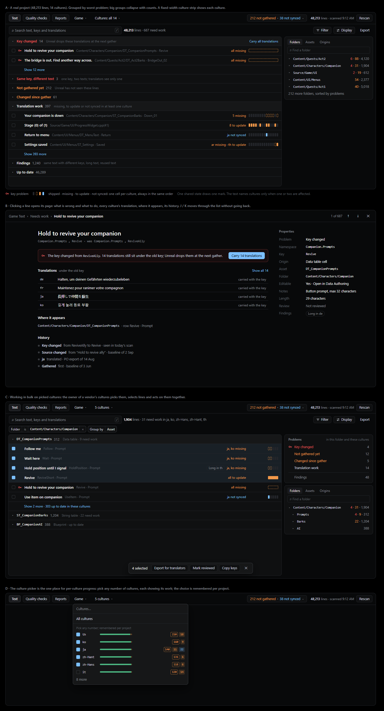

# Game Text review workspace

> Status: graduated to [`products/game-text.md`](../products/game-text.md#reviewing-text-in-workbench)
> by [Plan 053](../../plans/053-game-text-review-workspace.md). The mockup below is the design as
> proposed; where the product differs, the product document is authoritative. Named culture sets
> became a multi-select culture picker (Unreal has no culture groups), keyboard navigation and
> saved views were dropped as polish, and line history waits for a baseline store.

## Why

Game Text grew a chip for every check and state: text lenses, translation states, review lenses,
key changes, editing and notes toggles, and where text comes from. Each chip is useful alone; together
they wrap into rows that treat a lost translation and a long line as the same kind of thing, and they
stop scaling once a project has tens of thousands of lines, hundreds of problems and a dozen
cultures.

The people reviewing localization work in a round trip: text is authored in Unreal, gathered,
written in another tool, and brought back. Problems are not equal along that trip. A changed key
loses translations at the next gather; a line Unreal has not gathered is waiting on a step; a
missing translation is work for one culture; a long line or a repeated text is a finding to look
at. The workspace should show that difference instead of flattening it.

The model is a calm issue tracker: few controls that each hold a lot, a list that stays quiet until
something needs attention, and a page per line once you open it.

The mockup is a self-contained page, [`media/game-text-review/mockup.html`](media/game-text-review/mockup.html),
drawn with the Workbench theme tokens and invented sample data.

## Principles

- **Colour means severity, nothing else.** Red marks key problems, which lose work. Amber marks lines
  waiting on Unreal and translation work. Blue marks translations written but not yet in Unreal.
  Findings (same text with different keys, long text, reused text) and facts (gathered only,
  outside the target) get no colour. Origins are plain text.
- **Quiet by default.** A line with no problem draws no mark. Up-to-date lines collapse into one count.
- **One entry point per kind of control.** Search, Filter and Display, each labelled. Filter builds
  removable pills (`Folder is Content/Characters/Companion`, `Problem is any of …`, `Origin is not
C++`); typing in it finds folders, assets and source files first, since "my area" is the common
  question, and offers Problem, Translation, Finding, Changed files, Origin, Review, Editing and
  Translator notes one level down.
- **Unreal actions act on the target.** Gather and export, and Sync with Unreal, stay in the header
  beside the counts they resolve, because they run for the whole target, not for a group of lines.

## The list

- Grouped by worst problem by default: Key changed, Same key with different text, Not gathered yet,
  Changed since gather, Translation work, Findings, Up to date. A line appears once, under its worst
  problem.
- Big groups collapse with counts and open a page of lines at a time ("Show 393 more").
- Display changes the grouping (problem, folder, asset, origin, namespace), the order (worst first by
  default), whether up-to-date lines collapse, and which properties each line shows.
- A group can carry the action that resolves it when that action is about those lines, such as
  "Carry all translations" for key changes.
- Lines can be selected for bulk actions: export for translators, mark reviewed, copy keys.

## Cultures at scale

Projects ship a dozen or more cultures, so a line never lists them by name.

- **Culture strip.** One small cell per culture, always in the same order: empty when shipped,
  dashed when missing, amber when it needs an update, blue when not synced. It keeps one width
  whatever the number of cultures, so the status column lines up.
- **One shared state is one mark.** When every culture shares a state ("all missing"), the strip
  draws one bar instead of identical cells.
- **Summary text names cultures only when one or two are affected:** "ja, ko missing",
  "8 to update", "all missing".
- **Picked cultures.** The culture picker lists every culture with its missing, to-update and
  not-synced counts, and takes any number of them; the choice is remembered per project. It is the
  one place for per-culture progress. Picking cultures (a vendor's, a release wave's) narrows the
  strip, the counts and translation work to them; lines whose problems are all in other cultures
  leave "need work". Unreal has no culture groups, so named sets were left out: a remembered
  multi-select covers the same work without names to manage.

## The right pane

Until a line is opened, the right pane holds the facets the current grouping does not:

- grouped by problem, it offers Folders, Assets and Origins, sorted by where the problems are, with
  a find box for projects with hundreds of folders;
- grouped by folder or asset, it adds a Problems card counted inside the current filters and
  picked cultures.

Clicking a facet adds the matching filter pill.

## The line page

Opening a line shows a full page rather than a side panel:

- what is wrong and the one action that resolves it, such as "Carry 14 translations";
- every culture's translation, editable where Game Text can write it;
- where the line appears;
- its history from baselines and exports: when it was gathered, when its source or key changed,
  when a culture was translated;
- properties: problem, namespace, key, origin, asset, folder, editing authority, translator notes,
  length, review, findings.

Up and down (J and K) move through the list without going back.

## Open questions

- Grouping pages per group: each open group has its own cursor (answered by Plan 053).
- Which history the line page can show without a baseline taken before the change. Still open:
  history needs a baseline store first.
- How the strip reads for colour-blind users; the dashed and filled shapes carry state, but the
  amber and blue pair needs checking.
