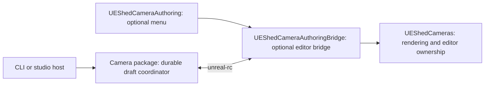

# Camera arrangement authoring

Camera-flow steps 1–3 provide an actor-scoped draft, native editing, synchronization, and approval into
a capture-only Review Set. The public owner is `@ue-shed/cameras`. The CLI and optional Unreal menu
use the same ports; Workbench is not required.

## Plugin boundary



Enable `UEShedCameraAuthoring` for the reference menu, or enable only
`UEShedCameraAuthoringBridge` for a studio's own native menu. Both are editor-only. Open **Window → UE
Shed Camera Authoring** after attaching a camera. The panel selects/pilots the active camera, displays
pending/synchronized state, requests Save for that camera, and detaches it. Transform and FOV editing
use Unreal's own viewport and Details panel, with native Undo/Redo.

Capture-only projects continue to enable Core+Cameras. The new `camera-authoring` source bundle preset
resolves the menu, bridge, Cameras, and Core dependencies; `map-review` retains its existing closure.
No authoring menu or bridge is needed to render approved cameras.

## Draft and command semantics

A `CameraArrangement` belongs to one subject actor in one project/map. Each camera has a stable ID,
destination View ID, generated direction, field overrides, and an optional pinned pose. Shared FOV,
distance scale, world-height offset, and framing margin affect only this arrangement. Separate actors
and separate arrangements on the same actor remain independent.

- `tune` changes shared settings. `override` replaces one camera's explicit override fields; omit a
  field from that replacement to resume inheritance.
- `pose` records native/manual editing. `poseChanged` pins placement; `lensChanged` changes only that
  camera's lens override. A lens-only edit does not pin placement. `unpin` resumes generated placement.
- `previewArrangementRegeneration` describes added, removed, and customized cameras.
  `regenerate` preserves exceptions for retained IDs, requires explicit acknowledgement before
  removing customized cameras, and forbids reuse of retired IDs.
- Every mutation names the arrangement, expected revision, and operation ID. Stale revisions and
  camera IDs outside the arrangement fail explicitly. Recent committed operation IDs are replayable;
  changing their input is an error. The store retains 256 operation outcomes.

The first vertical supports 1–256 perspective cameras and the existing 16:9 approved-pose contract.
The fit calculation accounts for both horizontal and vertical FOV. Layout galleries, additional
projection/aspect contracts, complete batch menus, and Workbench arrangement controls are later work.

`migrateLegacyCameraArrangement` explicitly imports an existing authoring session. Callers supply a
camera/View identity for every retained candidate. Imported poses are pinned so migration preserves
the existing approved/draft framing. Legacy Review Set 1.0–1.3 reading remains supported.

Approval emits Review Set **1.4**, with `view.authoring = { arrangementId, cameraId }`. This prevents
another arrangement from replacing an owned View. Other Views and their revisions are preserved.
Capture still consumes immutable approved poses; it never regenerates them from arrangement settings.

## Public service ports

`CameraAuthoringStore` exposes `create`, `load`, `mutate`, and `approve` as typed Effects.
`makeCameraAuthoringStore(path)` supplies atomic file writes, a cross-process writer lock, durable
operation outcomes, and an approval journal. Approval records the resulting Review Set and its export
intent together. Retrying the same operation repairs an interrupted export without issuing another
View revision. A changed export destination is a conflict, not an overwrite.

`CameraAuthoringBridge.call` accepts the language-neutral
[v1 wire contract](../../packages/protocol/contracts/cameras/authoring/v1/).
`makeCameraAuthoringBridge(client, endpoint)` implements it through the existing Unreal RC transport.
Discovery checks `cameras.authoring.v1`; missing-plugin, disconnected, protocol, busy, stale, and
unavailable conditions are typed.

`attachArrangementCamera(store, bridge, cameraId)` materializes one transient native camera.
`synchronizeArrangementCamera({ store, bridge, attachment, approvalDestination })` performs one bounded
reconciliation step. It imports native changes, processes a native Save request, and applies the
confirmed host state. Native sequence checks prevent a newer gesture from being overwritten by an
old acknowledgement. Confirmed host updates do not generate native edit echoes.
Continued native movement can advance through that producer's retained committed edits while an
acknowledgement is in flight; an intervening host edit still requires explicit conflict resolution.
If the camera changes after Save but before the host observes it, the bridge cancels that Save request
and asks the author to review and Save again.

Hosts own scheduling and lifetime. Replacing the file store or inserting a future synchronization
layer does not require replacing Unreal RC or the native menu. This feature does not implement the
separate [generic authoring synchronization concept](../ideas/authoring-sync-layer.md).

## CLI journey

The commands live under `ue-shed review authoring arrangement`. In this repository, prefix them with
`pnpm exec tsx scripts/ue-shed.ts`.

1. Write an input file containing `{ "arrangement": <CameraArrangement>, "reviewSet": <ReviewSet> }`.
   Use explicit project/map/actor locators and camera/View IDs. The checked-in
   [schemas](../../packages/protocol/contracts/cameras/authoring/v1/) describe every required field.
2. `review authoring arrangement create draft.json input.json`
3. `review authoring arrangement attach draft.json camera-a --endpoint http://localhost:30010 --output approved.json`
4. Edit the selected camera in Unreal, or use **Pilot camera** in the optional menu. Keep the CLI
   running; it reconciles every 200 ms and reports state changes.
5. Choose **Save this view** in Unreal. The host approves the reviewed camera into `approved.json`.
6. Interrupt the attach command to release the proxy. Restart either client and inspect with
   `review authoring arrangement show draft.json`. Existing Review capture commands accept the
   approved Review Set with Core+Cameras only.

Other commands are `patch draft.json command.json`, `approve draft.json approval.json`, and
`bridge request.json --endpoint <endpoint>`. Approval input is:

```json
{
	"operationId": "approve-camera-a-1",
	"expectedRevision": 3,
	"cameraId": "camera-a",
	"destination": "approved.json"
}
```

A shared-tuning command is:

```json
{
	"kind": "tune",
	"arrangementId": "subject-a-orbit",
	"expectedRevision": 2,
	"operationId": "tune-subject-a-3",
	"settings": {
		"distanceScale": 1.25,
		"fieldOfViewDegrees": 40,
		"heightOffset": 100
	}
}
```

## Ownership and recovery

One attached camera owns the editor authoring lease. Detach before batch capture or another
attachment. The 30-second lease, map loading, PIE begin, proxy deletion, and plugin shutdown release
the proxy and viewport ownership. Transient cameras are not saved into maps.

Overlapping native/host edits report a conflict and retain both states. The CLI preserves a native
snapshot at `draft.json.native-recovery.json` when it exits. The bridge also preserves pending native
state under the project's `Saved/UEShed/CameraAuthoringRecovery/` when releasing an unacknowledged
camera. Recovery is explicit: inspect both poses, submit the chosen change with the current host
revision, detach, and reattach. Do not automatically replay a stale native patch.

The file store reports an occupied lock as `busy`. After a process crash, verify the lock's recorded
PID is no longer running before removing its `.lock` file. Automatic stale-lock reclamation and a full
conflict-resolution UI belong to the later production recovery phase.

## Verification and remaining scope

`scripts/test-camera-authoring.ts <new evidence directory>` launches an isolated generic project with
an explicitly configured engine root. It exercises piloting, native pose/lens edits, synchronization,
Save, disk restart, editor restart with the authoring plugins disabled, and capture of the exact saved
camera. It records JSON evidence and a PNG. Set `UE_SHED_UNREAL_ENGINE_ROOT` before running it.

The [native proof](../engineering/camera-authoring-native-proof.md) also covers Undo/Redo, clean-map
save/reload, ownership/restoration, and view-local pixel exclusion. **Viewport culling remains
unadvertised** until phase 5 integrates the policy and proves the additional geometry cases. The
broader arrangement UI, actor-selection culling workflow, and production recovery/performance matrix
remain phases 4–6 of [Plan 049](../../plans/049-camera-authoring-and-actor-culling.md).
