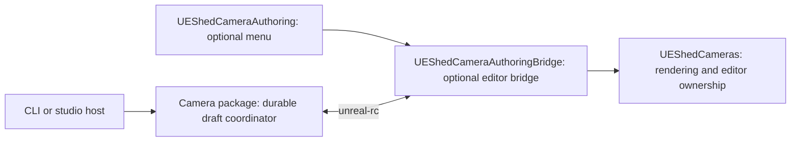

# Camera arrangement authoring

Camera-flow steps 1–5 provide scoped arrangements, native editing, culling, synchronization, and approval into
a capture-only Review Set. The public owner is `@ue-shed/cameras`. The CLI and optional Unreal menu
use the same ports; Workbench is not required.

See the [visual implementation walkthrough](../engineering/camera-flow-implementation.html)
for full Unreal-window screenshots, recordings, downloadable framing recipes, rendered comparisons,
and save/load examples through step 5. The new arrangement flow is not yet integrated into Electroswag.

The native walkthrough exposed an unresolved numeric-input bug: committing a shared FOV with Enter
can initially update the durable draft, then revert when focus moves. Tab commits persisted in the
recorded journey. Check the synchronized value after moving focus before approving Views.

## Plugin boundary



Enable `UEShedCameraAuthoring` for the reference menu, or enable only
`UEShedCameraAuthoringBridge` for a studio's own native menu. Both are editor-only. Open **Window → UE
Shed Camera Authoring** after attaching a camera. The panel selects/pilots the active camera, displays
pending/synchronized state, edits arrangements and actor exclusions, saves scoped Views, and detaches. Transform and FOV editing
use Unreal's own viewport and Details panel, with native Undo/Redo.

Capture-only projects continue to enable Core+Cameras. The new `camera-authoring` source bundle preset
resolves the menu, bridge, Cameras, and Core dependencies; `map-review` retains its existing closure.
No authoring menu or bridge is needed to render approved cameras.

## Draft and command semantics

A `CameraArrangement` belongs to one subject actor in one project/map. Each camera has a stable ID,
destination View ID, generated direction, field overrides, and an optional pinned pose. Shared FOV,
distance scale, world-height offset, and framing margin affect only this arrangement. Separate actors
and separate arrangements on the same actor remain independent.

- `tune` changes shared settings. `override` replaces one camera's explicit override fields; omit a
  field from that replacement to resume inheritance.
- `pose` records native/manual editing. `poseChanged` pins placement; `lensChanged` changes only that
  camera's lens override. A lens-only edit does not pin placement. `unpin` resumes generated placement.
- `previewArrangementRegeneration` describes added, removed, and customized cameras.
  `regenerate` preserves exceptions for retained IDs, requires explicit acknowledgement before
  removing customized cameras, and forbids reuse of retired IDs.
- Every mutation names the arrangement, expected revision, and operation ID. Stale revisions and
  camera IDs outside the arrangement fail explicitly. Recent committed operation IDs are replayable;
  changing their input is an error. The store retains 256 operation outcomes.

Authoring supports 1–256 perspective cameras and the existing 16:9 approved-pose contract.
The fit calculation accounts for both horizontal and vertical FOV. Additional projection/aspect contracts and Workbench arrangement controls are later work.

`migrateLegacyCameraArrangement` explicitly imports an existing authoring session. Callers supply a
camera/View identity for every retained candidate. Imported poses are pinned so migration preserves
the existing approved/draft framing. Legacy Review Set 1.0–1.3 reading remains supported.

Approval emits Review Set **1.4** for legacy drafts or **1.5** for explicit visibility output, with `view.authoring = { arrangementId, cameraId }`. This prevents
another arrangement from replacing an owned View. Other Views and their revisions are preserved.
Capture still consumes immutable approved poses; it never regenerates them from arrangement settings.

## Public service ports

`CameraAuthoringStore` exposes `create`, `load`, `mutate`, and `approve` as typed Effects.
`makeCameraAuthoringStore(path)` supplies atomic file writes, a cross-process writer lock, durable
operation outcomes, and an approval journal. Approval records the resulting Review Set and its export
intent together. Retrying the same operation repairs an interrupted export without issuing another
View revision. A changed export destination is a conflict, not an overwrite.

`CameraAuthoringBridge.call` accepts the language-neutral
[v1 wire contract](../../packages/protocol/contracts/cameras/authoring/v1/).
`makeCameraAuthoringBridge(client, endpoint)` implements it through the existing Unreal RC transport.
Discovery checks `cameras.authoring.v1`; missing-plugin, disconnected, protocol, busy, stale, and
unavailable conditions are typed.

`attachArrangementCamera(store, bridge, cameraId)` materializes one transient native camera.
`synchronizeArrangementCamera({ store, bridge, attachment, approvalDestination })` performs one bounded
reconciliation step. It imports native changes, processes a native Save request, and applies the
confirmed host state. Native sequence checks prevent a newer gesture from being overwritten by an
old acknowledgement. Confirmed host updates do not generate native edit echoes.
Continued native movement can advance through that producer's retained committed edits while an
acknowledgement is in flight; an intervening host edit still requires explicit conflict resolution.
If the camera changes after Save but before the host observes it, the bridge cancels that Save request
and asks the author to review and Save again.

Hosts own scheduling and lifetime. Replacing the file store or inserting a future synchronization
layer does not require replacing Unreal RC or the native menu. This feature does not implement the
separate [generic authoring synchronization concept](../ideas/authoring-sync-layer.md).

## CLI journey

The commands live under `ue-shed review authoring arrangement`. In this repository, prefix them with
`pnpm exec tsx scripts/ue-shed.ts`.

For a new actor, select it in Unreal, then run:

```sh
review authoring arrangement from-selection draft.json --endpoint http://localhost:30010
review authoring arrangement attach draft.json camera-1 --endpoint http://localhost:30010 --output approved.json
```

This starts with one fitted camera. Open the native panel to choose another layout or tune it.
The lower-level path for existing inputs is:

1. Write an input file containing `{ "arrangement": <CameraArrangement>, "reviewSet": <ReviewSet> }`.
   Use explicit project/map/actor locators and camera/View IDs. The checked-in
   [schemas](../../packages/protocol/contracts/cameras/authoring/v1/) describe every required field.
2. `review authoring arrangement create draft.json input.json`
3. `review authoring arrangement attach draft.json camera-a --endpoint http://localhost:30010 --output approved.json`
4. Edit the selected camera in Unreal, or use **Pilot camera** in the optional menu. Keep the CLI
   running; it reconciles every 200 ms and reports state changes.
5. Choose **Save views in current scope** in Unreal. The host approves the reviewed camera into `approved.json`.
6. Interrupt the attach command to release the proxy. Restart either client and inspect with
   `review authoring arrangement show draft.json`. Existing Review capture commands accept the
   approved Review Set with Core+Cameras only.

Other commands are `patch draft.json command.json`, `approve draft.json approval.json`, and
`bridge request.json --endpoint <endpoint>`. Approval input is:

```json
{
	"operationId": "approve-camera-a-1",
	"expectedRevision": 3,
	"cameraId": "camera-a",
	"destination": "approved.json"
}
```

A shared-tuning command is:

```json
{
	"kind": "tune",
	"arrangementId": "subject-a-orbit",
	"expectedRevision": 2,
	"operationId": "tune-subject-a-3",
	"settings": {
		"distanceScale": 1.25,
		"fieldOfViewDegrees": 40,
		"heightOffset": 100
	}
}
```

## Ownership and recovery

One attached camera owns the editor authoring lease. Detach before batch capture or another
attachment. The 30-second lease, map loading, PIE begin, proxy deletion, and plugin shutdown release
the proxy and viewport ownership. Transient cameras are not saved into maps.

Overlapping native/host edits report a conflict and retain both states. The CLI preserves a native
snapshot at `draft.json.native-recovery.json` when it exits. The bridge also preserves pending native
state under the project's `Saved/UEShed/CameraAuthoringRecovery/` when releasing an unacknowledged
camera. Recovery is explicit: inspect both poses, submit the chosen change with the current host
revision, detach, and reattach. Do not automatically replay a stale native patch.

The file store reports an occupied lock as `busy`. After a process crash, verify the lock's recorded
PID is no longer running before removing its `.lock` file. Automatic stale-lock reclamation and a full
conflict-resolution UI belong to the later production recovery phase.

## Verification and remaining scope

`scripts/test-camera-authoring.ts <new evidence directory>` launches an isolated generic project with
an explicitly configured engine root. It exercises piloting, native pose/lens edits, synchronization,
Save, disk restart, editor restart with the authoring plugins disabled, and capture of the exact saved
camera. It records JSON evidence and a PNG. Set `UE_SHED_UNREAL_ENGINE_ROOT` before running it.

The native proof now routes exclusions through real shared renderer sessions for both viewport and
SceneCapture. The supported scope is loaded, opaque, non-Nanite static-mesh actors. Instanced meshes,
translucency, and unloaded actors produce diagnostics instead of silently omitting an exclusion.
The broader geometry and production recovery/performance matrix remains step 6 of Plan 049.

## Arrangement editing and persistence

The optional Unreal panel shows the attached actor, camera count, active camera, draft revision,
draft file and approved Review Set path. Select a camera to edit its Transform and FOV in Details,
or pilot it in the Level Editor viewport. Camera selection in the panel is independent of the
Unreal actor selection used to choose blockers.

Choose an explicit editing scope: this actor's whole arrangement, a named group, or checked cameras.
Fields inherit from arrangement to group to camera. FOV, distance, height, elevation, yaw, margin,
and aim offsets are independently editable. Mixed selections show mixed scalar values; Inherit
removes only the chosen override. Native pose edits pin placement, while lens inheritance remains
independent. Dolly/world-Z moves deliberately pin affected cameras. Unpin resumes generated fitting.

Single, orbit, and arc layouts support 1-256 cameras. Layout and recipe imports first show added,
removed, and customized identities; accepting is a revision-checked operation. Retained identities
keep exceptions. Removing a draft camera does not delete its saved View: retired Views are listed,
and removing those saved definitions requires the explicit checkbox at arrangement scope.
Duplicate, reorder, rename, and add-from-current-viewport work without regenerating the set.

Draft changes autosave to the durable authoring document. **Save views** atomically publishes all
cameras in the displayed scope; other actors' Views cannot be included. Saved pose and effective
visibility lists are snapshots, so later group edits do not rewrite previous captures. Fixed exposure
can be set in the panel; saving creates a capture-profile snapshot without changing other Views'
profiles. Library/CLI `render_policy` commands accept the complete existing renderer policy.

Portable recipe JSON contains framing, group overrides and actor-relative manual positions, with
fresh camera/View identities allocated on import. It excludes actor locators, culling lists and saved
View ownership. Keep the draft to resume the exact actor setup; use a recipe to start another actor.
Recipe paths refer to the host running the package, not necessarily Unreal's machine.

Map-specific visibility presets are separate JSON files with their own identity and project/map scope.
Export the arrangement, a group, or one camera's local list to a new path. Presets cannot be overwritten;
export a replacement and explicitly adopt it in the selected scope. Adoption copies the list into
the draft, and previously saved Views retain their own snapshots.

## Explicit actor visibility

Select actors in Unreal, then **Hide selected actors in scope** or **Protect selected actors in scope**.
Shared, group and camera lists compose; protection wins, including GUID/path aliases resolved to the
same live actor. The capture subject is protected automatically. The panel displays effective lists
and resolution diagnostics. A GUID never falls back to a potentially reassigned path. Save views
validates authored references; drafts may retain unresolved entries for repair.

Choose Pure only, Authored only, or Pure + Authored. The native preview toggle applies only to the
piloted viewport, and capture applies the same lists through the shared renderer. Actor visibility
flags and map packages are not changed. Paired SceneCapture requires fixed EV100; viewport pairs may
meter the natural scene once and hold its exposure for Authored. Natural assessment belongs to Pure;
Authored-only has no natural-scene visibility score. Legacy Clear remains a separate workflow;
explicit authored output replaces its companion request for that View.

Review Set 1.5 and Capture/Run 1.7 carry authored policy and separately named artifact evidence.
Map Capture 1.2 accepts the same `capture.visibility`; live map previews use provisioning version 4.
`mapCaptureVisibilityVariants(plan, policy)` produces ordinary Pure/Authored plans, requiring fixed
exposure for a pair. Publish each returned plan as its own immutable run. Tile framing remains fixed.

## Replaceable menu integration

`CameraPanelAction`, `CameraPanelEvent`, `CameraPanelState` and `makeCameraAuthoringPanelSession` are
public package contracts. The reference menu submits revision-scoped events over unreal-rc; the host
owns durable mutations and acknowledges their outcomes. The bridge owns transient editor objects
and exposes selection, visibility resolution, camera activation, and published panel state. Studios
can replace the menu or store through those ports. Neither the Workbench nor the menu owns domain
policy, and no general distributed synchronization service is introduced here.

## Native workspace handoff

The optional menu groups its controls into Framing, Layout, Visibility, and Capture.
Shared framing applies only to the open actor set; individual cameras retain explicit
exceptions and manual poses. Selection and save status track the host panel snapshot.

A bridge `pilot` or `select` request emits `OnEditorFocusRequested`. The first-party
menu reveals its tab on that event. Replacement menus may subscribe to the same public
delegate; the bridge does not depend on the first-party menu.
