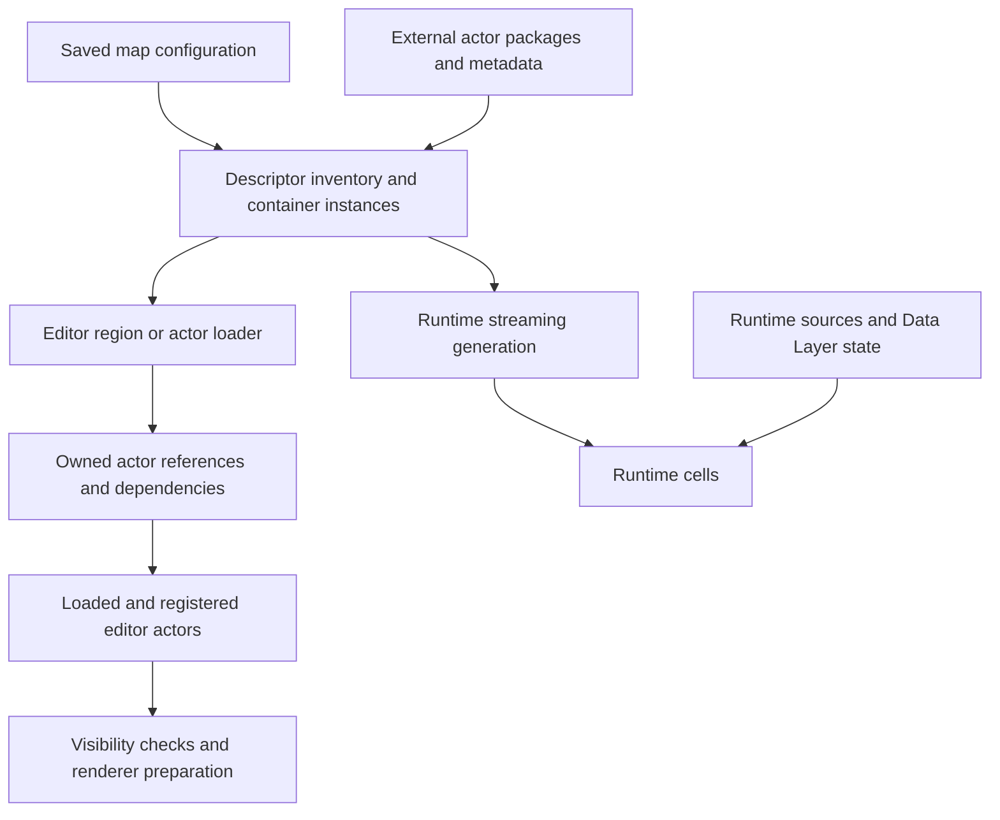

# World Partition: saved data, APIs, and scoped world preparation

Investigated 2026-09-10 against UE 5.7.4, changelist 51494982, and UE Shed revision `09d3797`.
This is research and a design recommendation, not a new product contract or implementation plan.

The subsequent implementation and live Unreal validation are documented in the
[shared world preparation contract](../products/world-preparation.md).

The investigation read the installed engine source, traced the maintained camera and saved-world
paths, and inspected the committed offline fixture bytes. It did not launch Unreal, reproduce a
live streaming failure, or measure loading performance. Findings below distinguish those forms of
evidence from proposed behavior.

World Partition gives us enough machinery to make selective loading a normal library operation.
The missing abstraction is **an owned working area with explicit readiness evidence**. Asking
whether streaming has finished cannot establish whether a requested scene is available.

The strongest findings are:

- The map file contains partition configuration, but external actor packages contain most actor
  instances and their compact descriptor metadata. Reading only the `.umap` misses that content.
- UE Shed already parses external actor properties and already owns camera region loaders. The
  work is to improve discovery, preparation semantics, and adoption across workflows.
- In this engine version, `UWorldPartition::IsStreamingCompleted` returns `true` for an editor
  world without checking its editor loading regions. Existing map capture checks cannot prove
  editor geometry readiness.
- Unreal's C++ APIs support descriptor queries and independent loading references. The scripting
  APIs are useful for exploration, but lack the ownership and evidence needed by multiple clients.
- Effect can scope preparation and recovery. Engine-side references, leases, admission limits,
  and restoration remain necessary; an interrupted TypeScript fiber cannot interrupt synchronous
  Unreal loading or clean up a crashed client by itself.

## What World Partition actually manages

World Partition separates an inventory of actors from the instantiated actors currently in a
world. An unloaded actor can still have a descriptor containing identity, bounds, class, references,
and layer membership. Searching that inventory does not require spawning every actor.

Three related systems need distinct treatment:

| System                            | Responsibility                                                                                             | Consequence for external tools                                                 |
| --------------------------------- | ---------------------------------------------------------------------------------------------------------- | ------------------------------------------------------------------------------ |
| One File Per Actor, or OFPA       | Stores actor instances in separate packages                                                                | A map is a package graph, not one self-contained file                          |
| Editor World Partition loading    | Selects descriptors and holds references to load actors into the editor world                              | A camera pose alone does not request the scene it sees                         |
| Runtime World Partition streaming | Generates and streams cells according to sources, runtime partition configuration, layer state, and policy | Runtime completion queries answer a different question from editor preparation |

OFPA can also be used without World Partition. Likewise, a world can be partitioned while its
streaming setting is disabled. Epic documents both independent OFPA use and partitioned templates
with streaming disabled. [OFPA documentation](https://dev.epicgames.com/documentation/en-us/unreal-engine/one-file-per-actor-in-unreal-engine?application_version=5.7),
[World Partition overview](https://dev.epicgames.com/documentation/en-us/unreal-engine/world-partition-in-unreal-engine?application_version=5.7).



The persistent level, editor spatial index, runtime cells, and our output tiles are different
partitions of the problem. Tile keys must not become assumed Unreal cell identifiers.

There is also no universal fixed runtime grid layout to reproduce. This installation's
`BaseEngine.ini` selects `WorldPartitionRuntimeHashSet` for new maps. Our offline fixture actually
contains that class and `RuntimePartitionLHGrid` objects. Other maps can use different configured
hash classes. Read the saved configuration and negotiate the live capability rather than assuming
the older `WorldPartitionRuntimeSpatialHash` layout shown in many examples.

## Where the data is saved

A `.umap` uses the same classic package container as a `.uasset`. Their extensions describe usage;
they do not require entirely separate package readers.

| Data                           | Saved location and evidence                                                     | What it can answer                                                                                    |
| ------------------------------ | ------------------------------------------------------------------------------- | ----------------------------------------------------------------------------------------------------- |
| World and level structure      | `.umap` exports including `World`, `Level`, and `WorldSettings`                 | Partition and external-packaging flags, references, internal objects                                  |
| Partition configuration        | `WorldPartition`, editor/runtime hash and runtime-partition objects in the map  | Streaming enabled, partition classes, serialized settings and HLOD references                         |
| External actor instance        | Commonly `Content/__ExternalActors__/<map-relative-path>/.../*.uasset`          | Actor and component properties, serialized references and transforms                                  |
| Compact actor descriptor       | Package Asset Registry tags `ActorMetaDataClass` and `ActorMetaData`            | Actor identity, bounds, spatial flag, grids, layers, references, and other version-dependent metadata |
| Non-external actor descriptors | `ActorsMetaData` map tag when Unreal saves a level without external actors      | Another descriptor source that a directory-only scan misses                                           |
| Other external objects         | External object packages, commonly under `__ExternalObjects__`                  | Supporting objects such as externally packaged actor folders; not another list of spatial actors      |
| Data Layers                    | Data Layer assets plus world-specific instances owned through `WorldDataLayers` | Asset identity/type and saved per-world hierarchy/default state; package placement must be followed   |
| HLOD representation            | HLOD configuration assets and generated actor/mesh/material packages            | Available proxy representation, not proof that source geometry is loaded                              |
| Runtime streaming cells        | Generated for PIE/cook and runtime use                                          | Not a static list of editor cell files that can be inferred from directory names                      |
| Current residency              | Live editor/runtime state and loading owners                                    | Cannot be recovered from the saved map alone                                                          |

The common external actor filename is derived from a hash of the actor path and encoded into a
directory scheme. It is not an XY coordinate or the actor GUID written as a filename. Verify the
package's metadata and logical actor path. Do not reconstruct identity by decoding a basename.

The conventional directory is only the starting point. Mounted plugin content, Level Instances,
External Data Layers, and Content Bundles extend container discovery. A complete tool needs an
explicit mounted-package/container resolver, and must report unsupported or unavailable containers.
It must also distinguish an empty actor set from files omitted by a partial workspace sync.

These details are verified in engine sources E1–E5 below. In particular, `UActorDescContainer`
scans package Asset Registry data for external actors and also reads internal actor metadata from
the map. It does not instantiate every actor to build its inventory.

### Descriptor serialization is accessible, but not just tagged properties

`ActorMetaData` is Base64-encoded binary. `SerializeTo` writes the descriptor's custom-version
container followed by its payload. The descriptor carries its own version information, so the
package's UE version alone is insufficient to select the decoder.

The payload is native serialization through `FActorDescArchive`, not the actor's ordinary UObject
property stream. Current serialization includes identity, relative transform and bounds, spatial
loading, runtime grid, editor/runtime flags, actor references, editor-only references, tags, Data
Layers, label, HLOD information, attachment/folder information, external-layer references, and
component descriptors, subject to version branches.

Several fields use delta serialization against a class descriptor. An omitted value can mean
“inherit from the class descriptor,” including a Blueprint class descriptor. It must not silently
become `false`, an empty array, or a generic Actor default. Native/project classes, Blueprint
inheritance, redirects, descriptor subclasses, and component descriptor extensions are the hard
parts of a portable decoder. Landscape, Level Instance, Packed Level, HLOD, and WorldDataLayers
descriptors have additional native behavior.

For an initial portable implementation, decoding a proven prefix and preserving the unsupported
remainder is useful. Every projected field needs a supported interpretation; unresolved defaults
must remain explicit. Reimplementing the whole engine class registry is not a prerequisite to
shipping a useful partial inventory. E3–E5 identify the relevant implementation.

### What the committed fixture proves

The existing native `uasset` executable successfully inspected
`fixtures/unreal-project/Content/Fixture/Offline/L_OfflineWorld.umap` as a classic UE4-522,
UE5-1018 package. Its 19 exports include `WorldPartition`, `WorldPartitionRuntimeHashSet`, three
`RuntimePartitionLHGrid` objects, and the ordinary world/level/settings objects.

The existing `saved-world` command scanned six external packages, resolved six actors, and reported
zero partial or failed packages. A separate read-only binary probe located the length-prefixed
`ActorMetaData` tag, decoded its Base64 value, read its custom-version header and class/identity
prefix, and matched each descriptor GUID to the generic actor export's `ActorGuid`.

| Fixture actor  | Package bytes | Descriptor bytes | GUID matches actor export |
| -------------- | ------------: | ---------------: | ------------------------- |
| Hub Attachment |         5,519 |              546 | Yes                       |
| West Marker    |         5,227 |              527 | Yes                       |
| East Marker    |         5,227 |              527 | Yes                       |
| North Marker   |         5,229 |              528 | Yes                       |
| Offline Hub    |         5,227 |              527 | Yes                       |
| South Marker   |         5,229 |              528 | Yes                       |

All six descriptors had four custom-version entries and native class `StaticMeshActor`. This
establishes that useful metadata exists in the committed bytes. The probe was deliberately limited
to these known fixtures: locating a tag signature is not a production Asset Registry section
reader, and matching identity is not conformance for bounds, default inheritance, or all classes.
The small payloads are not a measured IO speedup; filesystem overhead and indexing still matter.

Reproduce the existing parser portion after building the repository's native reader:

```powershell
$fixtureRoot = (Resolve-Path fixtures/unreal-project).Path
$fixtureMap = (Resolve-Path fixtures/unreal-project/Content/Fixture/Offline/L_OfflineWorld.umap).Path
./target/debug/uasset.exe inspect $fixtureMap --format json
./target/debug/uasset.exe saved-world $fixtureRoot $fixtureMap --format json
```

### Current parser gaps

The existing [saved-world projection](../../crates/uasset-inspection/src/saved_world.rs) is useful
but narrower than a World Partition inventory:

- It recognizes actors conservatively through a serialized `RootComponent` property. That does
  not prove discovery of all actors, especially rootless actors or omitted inherited properties.
- It resolves saved component transforms and attachments. It does not decode actor descriptors,
  provide their streaming bounds, or evaluate live construction scripts.
- The [IO discovery path](../../crates/uasset-io/src/direct_executor/project_io.rs) chooses
  `world_partition` based on whether the conventional external actor directory exists. OFPA is
  not proof of partitioning, and directory absence is not proof that partitioning is disabled.
- In that branch it scans the external actor packages instead of combining them with the map's
  own exports. The map can contain relevant internal objects; the fixture itself contains a
  `Brush` actor with a root component outside that external scan.
- Discovery currently requires a map beneath the project's `Content` directory. It is not a
  general mounted-content or nested-container resolver.
- The parser reads `asset_registry_data_offset` in the package summary but does not decode that
  section into a generic Asset Registry tag model.

Consequently, current `completeness: complete` describes that projection's successful inputs. It
must not be promoted into a claim that every actor or render dependency in the world is known.

The incremental parser path should preserve the established separation:

```text
bounded package bytes
  -> generic package Asset Registry entries and versioned descriptor evidence
  -> generic inspection, including unsupported/default-resolution evidence
  -> normalized saved-world inventory projection
  -> optional IO index across packages and containers
```

First decode the generic Asset Registry section using its summary offset, version conditions,
bounded strings/counts, and entry structure. Then add descriptor codecs driven by Unreal-generated
fixtures. Keep filesystem scans and dependency resolution outside the Rust bytes-to-evidence core.
Do not derive the new domain model by parsing serialized inspection JSON.

The useful first offline product is an unloaded actor index: identity, class, saved bounds/transform
when supported, package location, spatial policy, layers, references, and coverage. It can power
search, map overlays, change review, and preparation estimates without implementing runtime cell
generation or reading cooked IoStore packages.

## Why “loaded” keeps giving misleading answers

| State                  | What it establishes                                     | What it does not establish                                            |
| ---------------------- | ------------------------------------------------------- | --------------------------------------------------------------------- |
| Descriptor known       | Unreal or the saved reader knows about an actor         | A live `AActor` exists                                                |
| Package/actor loaded   | An object exists in memory                              | Components are registered and useful to this operation                |
| Components registered  | Components participate in the world/scene as applicable | The actor is visible through layers, hidden flags, or renderer policy |
| Data Layer loaded      | Its editor loading policy permits relevant actors       | Its layer hierarchy is visible                                        |
| Runtime cell Loaded    | Runtime content is resident at that state               | The cell has reached Activated/visible state                          |
| No streaming pending   | Current requested streaming work has settled            | The tool requested the correct area or actors                         |
| Render warmup finished | The requested number of frames elapsed                  | Texture, shader, lighting, temporal, or procedural convergence        |

Data Layer asset type, per-world instance, parent hierarchy, editor loaded state, editor visibility,
and runtime state must remain distinct. UE's manager resolves effective loading, and its editor
subsystem applies filtering and visibility. It supports project loading policy and External Data
Layer gating; do not hardcode “every listed layer must be true” as the general rule. Parent state
can defeat a child's local flag. See E8 and
[Epic's Data Layers documentation](https://dev.epicgames.com/documentation/en-us/unreal-engine/world-partition---data-layers-in-unreal-engine?application_version=5.7).

Non-spatial actors still have layer and relevance constraints. A huge spatial region does not
override disabled layers, absent feature content, hidden actors, missing classes, or gameplay
initialization. A successfully rendered HLOD proxy also does not establish source-actor residency.

Hard actor references expand the working set. The editor loader recursively acquires referenced
actors, and runtime streaming generation considers actor relationships. A tiny region can therefore
pull in a large dependency set. Explain that expansion and bound it where feasible. Do not promise
an exact actor or memory ceiling from the number of requested boxes. E6–E7 show the editor behavior.

## How good are the APIs?

The C++ primitives are strong enough for a production adapter. Their lifecycle and diagnostics are
not a complete external-tools contract.

| Need                              | UE 5.7 API                                                                                                                  | Assessment                                                                                                      |
| --------------------------------- | --------------------------------------------------------------------------------------------------------------------------- | --------------------------------------------------------------------------------------------------------------- |
| Inventory without loading actors  | `UWorldPartitionBlueprintLibrary::GetActorDescs`, `GetIntersectingActorDescs`; C++ container-instance iterators and helpers | Good starting point. Scripting returns arrays; a remote catalog needs pagination, limits, and revision identity |
| Bounds without loading all actors | `GetEditorWorldBounds`, descriptor editor/runtime bounds                                                                    | Useful saved/index evidence; not authoritative live component geometry                                          |
| Metadata handle                   | `FWorldPartitionHandle`                                                                                                     | Holds a descriptor reference without independently requesting actor residency                                   |
| Owned actor residency             | `FWorldPartitionReference`                                                                                                  | Engine hard-reference lifetime drives loading/unloading; ideal underlying resource primitive                    |
| Region loading in the editor      | `FLoaderAdapterShape`, spatial loader interfaces                                                                            | Uses editor bounds and filters, retains actor dependency references, handles container behavior                 |
| Explicit actor working set        | `FLoaderAdapterActorList`, including handle-based overloads                                                                 | More suitable for actor edits than guessing a spatial radius                                                    |
| Ad hoc scripting loads            | Blueprint/Python `load_actors`, `unload_actors`, pin/unpin                                                                  | Convenient, but no per-client lease or detailed loading result                                                  |
| Layer preparation                 | `UDataLayerEditorSubsystem`, `UDataLayerManager`, `UDataLayerInstance`                                                      | Useful operations and effective-state queries; needs shared mutation ownership and restoration                  |
| Runtime source control            | `UWorldPartitionSubsystem`, `IWorldPartitionStreamingSourceProvider`, streaming source component                            | Appropriate for PIE/game workflows; a separate backend from editor loaders                                      |
| Runtime completion                | Source-specific queries and requested cell state                                                                            | Useful after establishing a runtime demand; cannot prove editor geometry readiness                              |
| Batch world processing            | `UWorldPartitionBuilder` and builder commandlets                                                                            | Existing support for iterative bounded regions and rendering-enabled jobs                                       |

The actual scripting surface in this installation is `WorldPartitionBlueprintLibrary`. Its
[Python API](https://dev.epicgames.com/documentation/en-us/unreal-engine/python-api/class/WorldPartitionBlueprintLibrary?application_version=5.7)
exposes descriptor queries and actor load/unload. Do not design around an assumed
`WorldPartitionEditorSubsystem` name. Older descriptor/container methods also have deprecated
replacements in UE 5.7; use container-instance APIs verified against the supported engine.

There are several significant adapter obligations:

- **World identity:** stock scripting helpers use the editor world implicitly. Our request must
  validate project, world kind, map, and a session/world generation before applying anything.
- **Container identity:** an actor GUID alone is insufficient for repeated Level Instances.
  Carry the container-instance identity/path and transform as well as actor GUID. Preserve partial
  traversal failures rather than silently flattening nested worlds.
- **Ownership:** the Blueprint library uses a shared actor-list loader per partition. One client's
  unload call can remove a request another client made through that same list. Our native owner
  should hold its own references rather than borrowing that global scripting list.
- **Truthful outcomes:** loader `Load()` returns no structured per-actor success report, and
  `IsLoaded()` on a loader reports its enabled loading state. Verify requested actors and their
  registration/visibility separately. Some filter reasons are available, but cannot explain every
  loading owner, plugin, or engine failure.
- **Responsiveness:** loaders can perform substantial synchronous work on the game thread. Break
  work into admitted batches and yield between them. Timeouts are observable deadlines, not hard
  preemption or guaranteed watchdog responsiveness during a stalled engine call.
- **Unloading side effects:** normal editor loader unload paths can clear undo transactions and
  request garbage collection. Releasing references does not guarantee immediate memory reclamation
  or restoration of the entire editor undo history. Dirty/user-retained actors need explicit policy.

Sources E6–E9 cover these details. The useful quality judgment is: good native building blocks,
adequate scripting for diagnostics, and substantial room for a small shared library contract.

## Specific gaps in UE Shed's camera workflows

### The current World Partition readiness check is ineffective in editor worlds

In E9, both relevant `UWorldPartition::IsStreamingCompleted` overloads only consult the streaming
policy when `GetWorld()->IsGameWorld()` is true and a policy exists. Otherwise they return `true`.

[Map tile capture](../../unreal/Plugins/UEShedCameras/Source/UEShedCamerasEditor/Private/UEShedMapTileCapture.cpp)
flushes level streaming and calls `IsStreamingCompleted(nullptr)` around lines 557–568.
[Lit capture preflight](../../unreal/Plugins/UEShedCameras/Source/UEShedCamerasEditor/Private/UEShedLitMapTileCapture.cpp)
uses the same partition query around lines 325–329. These are editor-world workflows. The checks
cannot catch a required region that has never been loaded. The other conventional level-streaming
checks can still be useful, but they do not repair that missing guarantee.

This is a source-confirmed gap, not a reproduced diagnosis of every previous bad capture. Missing
layers, framing, renderer behavior, and preparation policy can independently produce similar images.

### Region preparation exists but is not yet a reusable working-set service

The [shared render session](../../unreal/Plugins/UEShedCameras/Source/UEShedCamerasEditor/Private/UEShedCameraRenderSession.cpp)
already:

- Applies explicitly requested Data Layer loaded/visible states and checks their effective state.
- Owns a `FLoaderAdapterShape` per distinct requested region and releases those objects on close.
- Uses a native owner and renewable lease, closes on world change/PIE/shutdown, and reports failed
  restoration rather than claiming success.
- Exposes partial preparation evidence, preserving the distinction from proven visibility.

Those are valuable foundations. Current limitations are concrete:

- `camera_regions` defaults to a box centered on the camera location with caller-supplied extents.
  This is not a frustum or ground-footprint query. A high top-down camera can load a box entirely
  above the ground it is photographing.
- Each distinct region remains held until the session closes. The cap is at most 64 regions, and
  exceeding it fails. It neither replaces old regions nor bounds the actors/assets retained inside
  them. Raising this cap would allow tiled capture to accumulate most of the map.
- The ordinary shape loader includes spatial actors by default. Non-spatial environment actors
  depend on their other loading/layer state and still need separate evidence.
- The initial-view/metering cameras do not acquire their own inferred regions. Preparation starts
  from the first frame's region, so an initial reference elsewhere needs an explicit load policy.
- The frame loop waits for conventional level-streaming transitions and frame counts; it does not
  compare an expected descriptor set with registered/renderable actors.
- Preparation belongs to the renderer today. Actor discovery, focus, authoring, and other services
  cannot acquire the same shared resource independently.

All map backends construct the legacy shared render request, whose preparation is
`preserve_loading` with no requested layers. The map request still rejects explicit Data Layers
with `data_layer_policy_unsupported`. The shared camera API's newer preparation feature therefore
does not automatically prepare existing map workflows.

The existing [camera product contract](../products/camera-rendering.md) describes these limits
honestly. Downstream callers need the same distinction in their preflight/results, not only in
documentation.

### Discovery and tests can conceal the missing scene

[Observatory's actor listing](../../unreal/Plugins/UEShedObservatory/Source/UEShedObservatoryEditor/Private/UEShedObservatoryLibrary.cpp)
uses `TActorIterator<AActor>`. It inventories instantiated actors; it cannot tell a client that an
unloaded descriptor exists. Keep that live authority, but add or join a descriptor inventory instead
of interpreting absence from live enumeration as deletion.

The [offline fixture generator](../../fixtures/unreal-project/Source/UEShedFixtureEditor/Private/UEShedBuildFixtureCommandlet.cpp)
creates its partitioned offline map with `bEnableWorldPartitionStreaming = false` around lines
2164–2165. The [camera preparation test](../../unreal/Plugins/UEShedCameras/Source/UEShedCamerasEditor/Private/UEShedCameraRenderTests.cpp)
opens that map, checks a region count and layer restoration, and checks the region budget. It does
not prove that an initially unloaded subject becomes renderable or that unrelated regions remain
unloaded. This is an important coverage gap, even if the current preparation test passes.

## A shared Effect service that makes this easier

Expose a headless domain service for world inventory and a separate service for live preparation.
Keep package parsing behind `@ue-shed/unreal-assets`; keep Unreal loading in a separately enabled
editor capability. A small shared world package/plugin is a reasonable eventual home. Final package
names should follow the first proven cross-domain slice, not force this responsibility into engine
process discovery or make it depend on cameras/Workbench.

The intended consumer experience is short. This is proposed API pseudocode, not a shipped API:

```ts
const program = Effect.scoped(
	Effect.gen(function* () {
		const preparation = yield* WorldPreparation;
		const lease = yield* preparation.acquire(requirements);
		yield* lease.checkReady();
		return yield* renderRequestedCamera();
	})
);
```

`requirements` identifies the world/session, explicit actor instances or regions, allowed layer
changes, required readiness, resource limits, and evidence policy. Acquisition is temporary scene
preparation; edits and saves remain separate operations with their own authority. A plan/inspect
operation can explain the proposed working set before a user starts an edit or expensive capture.

The current installed Effect version is `4.0.0-beta.98`. The repository already uses scoped
finalizers, lease renewal fibers, bounded streams, and typed restoration failures in
[camera-render.ts](../../packages/cameras/src/camera-render.ts). Reuse that design experience and
the [Effect guidance](../engineering/effect.md), while verifying concrete APIs against the pinned
source. `effect-solutions` was not available in this environment.

### What the service should own

| Layer                    | Responsibility                                                                                                                  |
| ------------------------ | ------------------------------------------------------------------------------------------------------------------------------- |
| Pure domain functions    | Region calculation, descriptor selection, dependency estimates, request comparison, scheduling order                            |
| Effect service           | Capability discovery, validated requests, scoped leases, bounded progress, cancellation, deadlines, typed errors, telemetry     |
| Native preparation owner | Actor/container references, loader objects, layer state ownership, game-thread execution, watchdog, world-change cleanup        |
| Renderer                 | Component/render readiness relevant to its backend, texture/lighting preparation, exposure, temporal settling, capture evidence |
| Consumer                 | Intent, acceptable representation and omissions, work/output policy, edits and publication                                      |

A region lease means “retain the resources for these requirements while the lease is valid.” It
must not mean “restore every actor to exactly the loaded/unloaded state observed before acquisition.”
Other tools, editor regions, dirty packages, and the user can also legitimately retain actors.
Release only owned references and report any restoration conflict.

Compatible region/actor requests can overlap using engine reference ownership. Data Layer mutations
need a separate conflict policy: two clients requesting opposite visibility states cannot both be
satisfied by reference counting. Start with serialized layer-changing operations, preserve user
changes detected during the lease, and report conflicts. Do not use independent snapshot/restore
pairs that overwrite each other. Capture's existing exclusive viewport owner should compose with
this shared service without nested ownership deadlocks.

Acquisition itself needs failure recovery. Allocate a client operation identity before requesting
native state, make repeated begin with the same identity/input idempotent, and reconcile a lost
response against that identity. A finalizer registered only after a successful begin response misses
the “native acquired, response lost” case. Keep native expiry as the backstop. Do not retry
indeterminate mutations under a new identity.

A useful lifecycle is planned → acquiring → preparing → ready/partial/blocked → releasing →
released/restoration-failed. Readiness is relative to a revision of the requirements and world.
Map changes, actor movement, Data Layer changes, and new container instances can invalidate it.
Long operations must observe or revalidate those changes before using their evidence.

### Evidence and errors worth exposing

Return separate observations for inventory coverage, actor residency, component registration,
effective layer state, renderer readiness, and final release. A single `ready: true` should only
be derived for a declared requirement set and authority.

Useful evidence includes requested actor/region identities; expected, resident and missing actor
counts; direct versus dependency loads; missing packages/classes; unsupported containers; requested
and effective layers; source-geometry versus HLOD policy; current owned regions; phase duration;
and the world/session revision. Keep unclassified engine failures as explicit unknown reasons.
Bounds and package sizes support estimates, not a promised resident-memory total.

Useful typed outcomes include `actor_unloaded`, `actor_missing`, `layer_blocked`,
`container_unavailable`, `coverage_unknown`, `budget_exceeded`, `world_changed`,
`preparation_timeout`, and `restoration_conflict`. Their payloads should carry the affected identity,
observed state, and next action. “Load everything and try again” should not be the only recovery.

Effect should enforce bounded queues and concurrency, tie renewal/progress fibers to scope,
and preserve both operation and cleanup failures. The native service must remain safe and usable
from non-Effect clients through the same versioned language-neutral protocol.

## Applying it to maps, cameras, and everyday edits

For top-down map capture, compute the load box from the tile's world XY footprint plus its rendered
gutter and a separately chosen context margin. Its vertical range must include scene geometry;
camera altitude is not a substitute. For a perspective camera, intersect a bounded view volume with
descriptor bounds and allow explicit distance/context policy. Off-screen shadow casters, lighting,
reflections, fog, landscape neighbors, and procedural dependencies mean a visible frustum alone
cannot prove pixel equivalence to loading the entire map.

Process tiles in spatially coherent order, retain a small neighborhood, and replace the working set
as capture advances. Acquire the next area's references before dropping the previous ones when the
budget permits; admit a smaller transition when overlap is too expensive. Shared lighting/context
can have a longer lease than tile geometry. Keep render/exposure session lifetime separate from
individual region lifetime. Measure retained actors/assets and real process memory rather than
counting loader boxes alone.

Two existing rendering policies need particular care:

- Lit map capture warms and meters a whole-map initial view. A selectively loaded world cannot
  provide the same metering scene implicitly. Use an explicit metering area, an authored fixed
  exposure, or a separately budgeted overview preparation. Record the choice.
- The owned freeze captures actor/component tick state. Incremental loading can introduce actors
  after freezing began. Verify and extend freeze ownership for newly admitted actors, and test
  landscape/foliage/procedural registration and render preparation as working sets change. Do not
  assume streamed-in content has the same time state as actors present at initial warmup.

For fixed-pose Review captures, geometry preparation should be based on the approved camera and
scene requirements. For actor-relative views or bounds-based authoring, first resolve the actor
descriptor, temporarily realize the actor when necessary, then obtain live bounds. Descriptor
bounds can support an initial proposal, but must be labeled as saved/index evidence.

For developer editing, a useful workflow is search unloaded actors → select a task working set →
explain required actors/layers/dependencies → load only that set → edit. A named working set could
refer to an actor, area, camera, or changed-package list and live in a portable tool document.
It need not add a persistent Unreal volume to every map. Modified actors should remain retained or
be handed over to explicit user ownership until the edit/save workflow releases them.

An unloaded-actor overlay and “why unavailable” inspection are likely more valuable first UI work
than another cell-grid editor. They let a user distinguish a missing file, an unloaded actor, a
hidden layer, a proxy, and a not-yet-ready render. The same diagnostics belong in the CLI and library.

## Headless operation and Epic's builder path

Saved inventory needs no Unreal process. Live descriptor inspection needs a loaded editor world
and available classes/plugins, but does not require every actor to be instantiated. Rendering needs
an appropriate rendering process/backend; the existing Lit viewport renderer still requires its
editor viewport and cannot simply run under NullRHI.

Epic already provides a batch alternative. `UWorldPartitionBuilder` supports iterative cells,
including 2D iteration spanning the world's vertical bounds, configurable overlap, region loaders,
and garbage-collection checkpoints. `WorldPartitionMiniMapBuilder` captures and assembles regions.
This is useful behavioral reference for a future unattended capture backend. E10 and
[the builder commandlet reference](https://dev.epicgames.com/documentation/en-us/unreal-engine/world-partition-builder-commandlet-reference?application_version=5.7)
describe that path.

It is not a drop-in replacement for UE Shed's immutable PNG pyramid: the minimap builder creates or
updates Unreal minimap assets, has its own capture/render policy, and can save packages. A dedicated
rendering worker could adopt iterative preparation while preserving our output contract and keeping
heavy loading away from the developer's editor. Do not claim identical viewport pixels or immediate
compatibility without a rendering experiment.

## Recommended sequence and proof requirements

1. **Make the failure visible.** Add source-correct editor readiness diagnostics to camera/map
   preflight, distinguish unloaded actors from missing ones, and surface descriptor versus live
   coverage. Preserve existing policies while making their limits inspectable.
2. **Prove selective loading on a real fixture.** Add a small partitioned map with streaming
   enabled, separated subject/context regions, layer hierarchy, dependencies, and known unloaded
   actors. Demonstrate load, capture/use, and release through the public library/CLI seam.
3. **Extract shared ownership from the proven camera preparation.** Introduce a versioned native
   preparation capability and an Effect service. Add explicit actor-instance requests, replaceable
   region working sets, owned restoration, and actor-specific evidence. Prove a second consumer
   such as Observatory focus/inspection before expanding the abstraction.
4. **Adopt it in Map Capture.** Version its preparation policy, acquire the correct footprint,
   preserve exposure/freeze semantics, advance a bounded region window, and record preparation
   evidence in published runs. Legacy plugins must report unsupported preparation honestly.
5. **Expand portable inventory.** Decode package registry tags and supported descriptors, combine
   internal/external sources, resolve mounted containers, and build an incremental index. This
   can progress independently; it should not delay the live loading correctness fix.

The critical validation matrix is behavioral:

| Case                                                          | Required evidence                                                          |
| ------------------------------------------------------------- | -------------------------------------------------------------------------- |
| Actor exists but its region is unloaded                       | Inventory finds it; live enumeration does not; readiness diagnoses it      |
| Small region acquisition                                      | Subject loads and becomes usable; distant unrelated subject stays unloaded |
| Disabled child or parent layer                                | Exact blocker or effective state is reported; no silent success            |
| Reference outside requested region                            | Dependency expansion is visible and budgets handle it                      |
| Two overlapping leases                                        | Releasing one keeps the other's actors usable                              |
| User pins or edits an actor during a lease                    | Release preserves independent ownership and dirty work                     |
| More than 64 sequential tile positions                        | Bounded replacement succeeds without cumulative whole-map retention        |
| Elevated camera and distant metering view                     | Ground/subject and reference-view preparation are independently correct    |
| New actors after freeze                                       | Their tick/material/render behavior is covered by explicit evidence        |
| Missing package, Blueprint base, or custom descriptor         | Partial/unsupported state is preserved, not invented defaults              |
| Repeated transformed Level Instance                           | Instance identity and world-space bounds stay distinct                     |
| Cancellation, lost begin response, client death, world change | Owned references/layers recover; cleanup failures remain visible           |
| Streaming-disabled and non-partitioned worlds                 | Behavior remains useful without pretending selective streaming was tested  |

Use pure tests for region math and admission policy, Effect tests for lifecycle and reconciliation,
protocol conformance for both producers, and real Unreal tests for loading and rendering behavior.
For descriptor codecs, compare a normalized saved projection with an independent Unreal
descriptor/reflection producer in a fresh process. Cover inherited defaults and specialized
descriptors as well as simple StaticMeshActors. Add malformed counts, truncated strings, invalid
Base64, unknown versions, and allocation limits at the byte boundary.

The immediate recommendation is to prioritize **diagnostics plus one real selective-loading slice**.
The existing C++ and Effect lifecycle already supplies much of the foundation. Portable descriptor
indexing is the next major improvement for discoverability, offline tools, and working-set planning.

## Engine source map

Paths are relative to the discovered installation's `Engine/Source`, except the configuration row.
These are development references, not runtime path defaults. Symbol names are the stable navigation
aid; line numbers below refer only to the investigated 5.7.4 source.

| ID  | Source and useful symbols                                                                                                                                                                                                                                                                                 |
| --- | --------------------------------------------------------------------------------------------------------------------------------------------------------------------------------------------------------------------------------------------------------------------------------------------------------- |
| E1  | `Runtime/Engine/Private/Level.cpp`: `GetActorPackageName` around 4048, external actor path providers and packaging flags                                                                                                                                                                                  |
| E2  | `Runtime/Engine/Private/World.cpp`: `GetExtendedAssetRegistryTagsForSave` around 10194; `ActorsMetaData` for non-external levels                                                                                                                                                                          |
| E3  | `Runtime/Engine/Private/WorldPartition/WorldPartitionActorDescUtils.cpp`: metadata tag names, Base64 conversion and native descriptor creation                                                                                                                                                            |
| E4  | `Runtime/Engine/Private/WorldPartition/WorldPartitionActorDesc.cpp`: `SerializeTo` around 481, `Serialize` around 706; `WorldPartitionActorDescArchive.cpp` and public `.h`: class defaults and delta serialization                                                                                       |
| E5  | `Runtime/AssetRegistry/Private/PackageReader.cpp`: `ReadAssetRegistryData`, `ReadPackageDataMain`; `Runtime/Engine/Private/WorldPartition/ActorDescContainer.cpp`: `Initialize`; `WorldPartitionClassDescRegistry.cpp`: Blueprint/class metadata                                                          |
| E6  | `Runtime/Engine/Private/WorldPartition/WorldPartitionActorLoaderInterface.cpp`: loader lifecycle, filtering, dependency references and `PostLoadedStateChanged`; `LoaderAdapter/LoaderAdapterSpatial.cpp`, `LoaderAdapterShape.cpp`, `LoaderAdapterActorList.cpp`                                         |
| E7  | `Runtime/Engine/Public/WorldPartition/WorldPartitionActorDescInstance.h`: identity, loaded actor, bounds and unloaded reason; `WorldPartitionHandle.h` and private `.cpp`: soft/hard reference behavior                                                                                                   |
| E8  | `Editor/DataLayerEditor/Private/DataLayer/DataLayerEditorSubsystem.cpp`: descriptor filter, `PassDataLayersFilter`, visibility and state mutation; `Runtime/Engine/Private/WorldPartition/DataLayer/DataLayerManager.cpp`: `ResolveIsLoadedInEditor`                                                      |
| E9  | `Runtime/Engine/Private/WorldPartition/WorldPartition.cpp`: `IsStreamingCompleted` around 1953; `Runtime/Engine/Public/WorldPartition/WorldPartitionSubsystem.h`: runtime source APIs; `Runtime/Engine/Private/WorldPartitionBlueprintLibrary.cpp` and public header: scripting API and shared loader map |
| E10 | `Editor/UnrealEd/Private/WorldPartition/WorldPartitionBuilder.cpp`: iterative loading around 202–280; `WorldPartitionMiniMapBuilder.cpp`: preparation, capture, texture assembly and save behavior                                                                                                        |
| E11 | `Engine/Config/BaseEngine.ini`: `RuntimeHashDefaultClass`; `Runtime/Engine/Public/WorldPartition/WorldPartitionSettings.h`: configured defaults                                                                                                                                                           |
