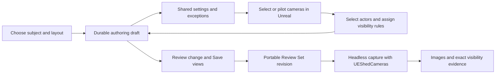

# 049 — Camera authoring in Unreal and explicit actor culling

Design proposal, 2026-09-09. Implementation status is tracked in [the plan index](README.md).
This document proposes behavior; it does not change the shipped product contract.

## Step 6 hardening record (2026-09-21)

- Implemented automatic dead-local-writer recovery with atomic directory ownership and conservative
  refusal of live, foreign, malformed and legacy locks. Process tests kill writers before/after draft
  commit and before approval export, race eight recovery attempts, and interrupt an active commit.
- Added explicit saved/native conflict review in the public API, CLI and Workbench, with revision and
  gesture checks. Preserved-file recovery is available without Unreal and does not publish Views.
- Added a clean packed camera consumer and a separate native menu example built against public
  headers. The real round trip runs with the reference menu and Workbench absent, then captures
  after restart with both authoring plugins disabled.
- Added native 1/6/37-camera movement/render-work measurements, one-live-capture bounds, cleanup and
  PIE transition assertions, plus host RC-to-durable-ack measurements. The runner exercises actual
  30-second lease expiry, recovery-file replay, and live conflict resolution.
- Added explicit refusal tests for Nanite-configured meshes, instanced meshes and translucency.
  Loaded opaque non-Nanite meshes remain the supported exclusion scope.
- Verification and measurements are recorded in
  [native proof](../docs/engineering/camera-authoring-native-proof.md). Full local `pnpm check`,
  `check:precommit` and `check:unreal` passed, along with native automation and independent-menu
  round trips on UE 5.7 and 5.8. Versioning, release-commit CI and publication are separate work.

Production-map responsiveness, the 256-camera upper limit's performance, broader geometry support,
network-shared draft storage and a complete replacement UI are not promoted by the stock-fixture proof.
The old candidate-UI recording driver still needs migration; the maintained release gate now covers
Camera Sets creation, 4/37-camera save/restart/capture and gallery rendering.

[Open the visual HTML companion](049-camera-authoring-and-actor-culling.html) for the author journey,
interactive camera-inheritance example, architecture, and implementation gates.

## Outcome and scope

An author can select a subject actor, start with one camera or an arbitrary arrangement, tune that
actor's linked camera set, move individual cameras using Unreal's native controls, and select actors in Unreal
to exclude from particular captures. Camera exceptions survive subsequent batch edits. Saving
produces portable definitions outside the map; a later headless capture reproduces those choices.

The user's actor-oriented workflow belongs primarily to
[Map Review](../docs/products/map-review.md). [Map Capture](../docs/products/map-capture.md) is the
orthographic tile-pyramid product. Both use the [shared renderer](../docs/products/camera-rendering.md).
Implement reusable authoring and visibility primitives, integrate Review first, and apply the same
visibility definition to a whole tile plan. A tile grid is not a collection of independently authored
perspective cameras: arbitrary tile-camera edits would break its geometry and assembly contract.

Proposed plugin dependency: **UEShedCameraAuthoring → UEShedCameraAuthoringBridge → UEShedCameras**.
The menu and bridge are separate, editor-only, opt-in plugins. The menu owns the panel and Details
customizations; the bridge owns transient authoring proxies, selection/piloting integration, editor
events, and native synchronization. Rendering and capture-time culling remain in UEShedCameras.
Existing capture consumers need neither authoring plugin. Public TypeScript domain behavior and the
Node-hosted coordinator remain in `@ue-shed/cameras`; no new npm package is necessary initially.

## What exists and what needs to change

Source baseline: `519dac3` on `main`, inspected on 2026-09-09.

| Existing implementation                                                                                                                    | Consequence for this work                                                                                                                                 |
| ------------------------------------------------------------------------------------------------------------------------------------------ | --------------------------------------------------------------------------------------------------------------------------------------------------------- |
| `review-framing.ts` generates exact positive arc/ring counts; defaults combine Context, Facade, and a four-camera ring                     | Six candidates are a default mix, not a domain limit. Expose deliberate starting layouts rather than always generating that mix.                          |
| `FramingParameters` has global FOV/margin, group distance/elevation, and partial candidate overrides                                       | Extend these primitives with explicit inheritance, world-space offsets, aspect-aware fitting, and durable exceptions.                                     |
| Candidate identity is `preset/<group>/<index>`                                                                                             | Count/layout changes can change the meaning of an index. Separate durable camera identity from its generation slot.                                       |
| `ReviewAuthoringSessions.patch` regenerates candidates for framing changes, clears the selected draft pose, and filters removed overrides  | A production rig needs per-camera drafts and a reviewed regeneration diff; discarded exceptions cannot disappear implicitly.                              |
| `ApprovedPose` is perspective and fixed to `16:9`; fitting uses a bounds sphere and horizontal FOV                                         | Add supported aspect handling deliberately; do not present arbitrary aspect or orthographic Review cameras as already supported.                          |
| `VisibilityOverrides` uses actor paths and bounds each of `hideInClear`/`neverHide` to 32 entries                                          | Add selection-driven authoring and stable locators with negotiated limits. Never silently truncate a large editor selection.                              |
| `visibility-policy-settings.tsx` asks for newline-separated actor paths                                                                    | Replace the primary interaction with actor lists, selection import, provenance, and resolution diagnostics. Retain explicit locator input for automation. |
| Clear is a SceneCapture companion, while the editor viewport reports it unsupported                                                        | Earn viewport support with engine evidence; do not substitute a renderer or label altered pixels Pure.                                                    |
| Provisioned previews use transient `AUEShedCameraSource` SceneCapture actors; the shared viewport renderer owns a temporary `ACameraActor` | Give authors separate camera proxies. Do not expose an internal render-session actor as an editable long-lived camera.                                    |
| Durable sessions, Review Set revisions, CLI authoring, and immutable Capture Runs already exist                                            | Extend their ownership and migration paths rather than introduce another profile store or transport owned by Workbench.                                   |

Some product prose describes broader future capabilities than the executable schema. Implementation
must use the schema and conformance fixtures as the supported baseline, then update the focused
product contracts when the new behavior actually ships.

## Author journey

### 1. Choose what to observe and how to start

From UE Shed, inspect the actor and choose **Add views**. From Unreal, select the subject and choose
**UE Shed → Add views from selection** in the authoring panel. Both create the same durable draft,
with an explicit Review Set and append/revise destination. Selecting an actor alone never saves it.

Present starting layouts before generating the contact sheet:

- **Current Unreal view**: one camera copied from an explicitly identified perspective viewport.
- **Single view**: one fitted front or three-quarter camera.
- **Orbit**: exact count, starting angle, world or subject orientation, and elevation.
- **Arc**: exact count, angular span, facing direction, and elevation.
- **Custom arrangement**: compose groups, add from current viewport, duplicate, reorder, and remove.
- **Saved recipe**: a portable, versioned starting arrangement with no live actor pointers.

Default new interactive sessions to Single view; retain the old mixed arrangement as a named preset.
Keep the existing public generator default for compatibility until an explicit versioned change.
Expose four-view and six-view orbit shortcuts. Label an orbit by its count; do not call every layout
“cardinal.” Top/bottom directions, if offered later, must be explicit directions rather than a
different interpretation of the six-view orbit.

Show a lightweight camera list/frustum overview immediately. Generate all requested definitions,
but schedule image previews only for the active camera and visible thumbnails. Counts above the
comfortable UI range remain valid and are paged, never silently reduced.

### 2. Tune this actor's camera set, then make exceptions

Shared tuning is scoped to the active camera arrangement linked to one subject actor. A Review Set
may contain views of many actors; it is a storage collection, not the scope of these controls. Show
the actor name and camera-set name/count above the controls. If an actor has multiple arrangements,
explicitly choose the active one rather than combining them.

Use one visible edit scope: **This actor's camera set**, **Group in this set**, or **Selected cameras
in this set (N)**. Every scope remains inside that linked arrangement. Mixed values show as mixed.
Each field shows its effective value and whether it is inherited or overridden. “Reset to inherited”
is a first-class action. Users can select several cameras without changing the subject. Switching
actors switches the displayed draft context after pending edits are flushed; it never retargets an
in-flight edit. Actor selection for culling keeps the subject and camera-set context pinned.

Public batch commands carry explicit subject and arrangement identities plus camera IDs and expected
revision. Validate that every camera belongs to that arrangement and subject; reject mixed-actor or
mixed-arrangement requests. Reusing a recipe supplies initial values, not a live connection that
propagates tuning to other actors. A broader multi-actor batch editor is outside this workflow.

Initial controls:

| Control                     | Meaning                                                                                                                                                      |
| --------------------------- | ------------------------------------------------------------------------------------------------------------------------------------------------------------ |
| Horizontal FOV              | Degrees, with output aspect shown beside it. In fitted mode, changing FOV recomputes fit distance; in manual mode it changes the lens at the saved position. |
| Framing margin              | Fraction of each image edge reserved around projected bounds. Validate both axes at the output aspect.                                                       |
| Distance multiplier / Dolly | Multiplier relative to fit for generated cameras; explicit movement along each camera's viewing direction for manual batch operations.                       |
| Elevation / Height offset   | Existing normalized elevation plus an independently labeled world-Z offset in cm. A height offset is not a pitch adjustment.                                 |
| Aim offset                  | Offset from subject bounds center, with explicit world or subject coordinates; permits entrances/details instead of always aiming at the center.             |
| Yaw, span, count            | Group distribution parameters, with explicit world/subject orientation.                                                                                      |
| Position, rotation, lens    | Exact per-camera values, editable in Unreal or numerically through the public session API.                                                                   |

Inheritance is field-by-field: recipe defaults → group overrides → camera overrides. Store absence
as inheritance; store an explicit value as an override. Avoid nesting copied full profiles.

Pose mode is separate from lens and visibility:

- **Generated**: shared framing changes recompute pose, retaining field overrides.
- **Manual**: a direct Unreal pose edit pins that camera's pose. Shared generation changes leave its
  pose intact; lens fields continue inheriting unless explicitly overridden.
- **Follow target**: preserve the existing target-relative viewpoint meaning. Convert an edited world
  pose using the recorded target transform and reject/reconcile target drift before accepting it.

Do not make a manual tweak silently detach every property. Before a batch change, show affected
cameras and skipped manual poses. **Include manual cameras** is an explicit batch transformation,
with an inspectable before/after diff. **Reframe** is separately deliberate and offers reset-to-recipe
or retain-exceptions; it does not run because the user selects a different camera.

For “everything farther away, narrower FOV, slightly higher, except this camera,” “everything” means
the cameras in this actor's active set. Set shared
distance/FOV/height, override the exception's chosen fields, and pin its pose only if necessary.
These choices must still work after Save, editor restart, and reopening the arrangement for editing.

### 3. Edit the camera in Unreal

Each camera has **Edit in Unreal**. It activates the correct editor session, opens the native panel,
materializes/selects that camera's transient proxy, and exposes normal transform gizmos and Details.
**Pilot** enters the native perspective camera view; **Stop piloting** releases it. Selection and
piloting are distinct actions. The panel offers next/previous camera, multi-selection, shared
settings, effective overrides, and the active view's hidden-actor list.

Dragging and flying happen entirely in Unreal. They must not wait for PNG/BGRA frames, Electron
painting, a host acknowledgement, or a complete contact-sheet refresh. UE Shed receives small pose
updates; thumbnails follow asynchronously. Native camera movement remains useful with previews off.
Rig parameter changes use the public domain service; the panel shows pending state until the
canonical generated result arrives. Do not copy the framing algorithm into C++ to mask transport lag.

The Unreal panel can also **Add camera from this viewport**, **Duplicate camera**, and select an
existing saved view for revision. Importing a stock camera copies supported pose/projection values;
it does not mutate or take ownership of the user's authored camera. Unsupported camera properties
produce an explicit import diagnostic. CineCamera filmback, focus, animation, and Sequencer
integration are separate work, not silently approximated lens support.

**Return to UE Shed** flushes the final native edit and leaves a resumable draft. It is not required
after every movement. **Save views** in either surface is the same explicit Review Set approval:
show added/revised/removed views, visibility changes, and skipped/conflicted items before committing.
Ordinary draft edits autosave without repeated prompts. **Discard draft** restores the last durable
approved definition and releases proxies.

### 4. Select actors to cull

Keep the active view pinned in the authoring panel while the author selects blockers in the Outliner
or viewport. Selection of a column must never replace the active capture subject or choose a camera.
Offer **Hide selected in this view**, **Hide selected in selected views**, and **Protect selected**.
Show the exact destination names/count; no operation infers its scope from the last hovered card.

The list shows actor label, locator details, inherited/local origin, and resolved/missing/ambiguous
state. Authors can reveal an entry in the Outliner, remove a local exclusion, or create a local
exception to an inherited rule. A preview toggle reveals excluded actors temporarily for selection;
it changes neither the saved rule nor capture output. Selecting a hidden actor by list still works.

Reusable visibility presets can carry shared exclusions, while each view carries local rules.
Editing a preset creates an immutable replacement and explicitly chooses which views adopt it.
The UI may group this under “View settings”; it must preserve the existing distinction between
Capture Profile, Visibility Policy, and Review View overrides in the domain.

### 5. Capture and reuse

Save freezes the approved poses, lens values, resolved authoring inheritance, visibility intent,
and provenance into a new Review Set revision. Capture uses that immutable snapshot, never whatever
camera currently happens to be selected in Unreal. Reopening for authoring can use the retained
recipe and overrides; repeat capture does not regenerate cameras or follow a mutable preset.

Offer **Original**, **Authored**, and **Original + Authored** output choices. “Authored” means the
capture applies the explicit visibility rules. Existing Pure/Natural and Clear identities remain
readable and keep their semantics; the new authored-only choice needs versioned contracts and
artifact validation. Preserve Original as the default for migrated sets. Selecting “hide” in a
draft offers/enables Authored output visibly, rather than storing an ineffective hidden list.

Authored images are permanently labeled and retain the exact intervention. A comparison warns when
camera or visibility revisions differ. Heuristics may suggest blockers for selection, but never add
exclusions automatically. This feature does not claim to improve Unreal's automatic rendering culling.



## Durable model and edit semantics

Extend the existing session and Review Set schema instead of introducing a second session store.
Proposed additions, with exact wire versions decided in phase 2:

- A durable arrangement identity linked to one explicit subject actor locator, recipe version,
  shared defaults, and groups. Camera membership enforces that actor-scoped edit boundary. This is
  an authoring camera set, not the multi-actor Review Set or a subject-history entity. Existing
  independent Views remain valid; do not infer shared edit membership from labels or selection.
- Stable draft camera IDs independent of labels/order/generator slots, mapped explicitly to durable
  View IDs at approval. Retain slot provenance as metadata, not identity.
- Per-camera pose mode, draft pose, lens/parameter overrides, visibility rules, and adjustment origin.
  Replace the session's single selected `draftPose` with a migrated per-camera representation.
- A monotonically increasing draft revision, per-camera revision, and base Review Set digest for
  concurrency checks. Store manual edits and undo history at gesture/command boundaries, not frames.
- A regeneration proposal listing retained, added, moved, and removed cameras. Reducing count or
  replacing layout cannot silently delete a manually adjusted or visibility-customized camera.
  Let the author retain it as a manual camera or explicitly remove it; preserve its ID when retained.
- Versioned portable recipe presets with no hardcoded project actors. Saving actor-specific
  exclusions into a recipe requires an explicit map-scoped preset, rather than leaking them into a
  generic starting layout.

Approval updates affected View revisions through one domain operation. Updating a visibility preset
assignment or effective exclusion must advance the appropriate View revision, just as pose edits do.
Use atomic Review Set writes plus a recoverable commit record so a crash between set save and session
status update cannot append duplicate Views. Validate the base digest under a cross-process lock;
an atomic rename alone does not prevent lost updates from two writers.

## Visibility model and render truth

Use a shared actor-locator union based on existing GUID/path subject locators. A GUID is scoped to
the map and, where needed, a verified level-instance identity. Labels and last-known paths are
diagnostic. Never select a same-named actor as fallback after a GUID stops resolving. Legacy path
entries migrate losslessly as path entries; report their weaker rename durability.

Resolve explicit actor rules to component identities inside each render operation. The initial unit
is an actor's supported renderable components, not individual foliage instances or arbitrary
component paths. Child actors, instanced level actors, HLOD replacement, unloaded World Partition
actors, and components registered after resolution require explicit capability/result handling.
Unsupported correspondence cannot produce a success claiming that all requested actors were hidden.

Deterministic visibility precedence:

1. Start with the exact immutable preset's exclusions.
2. Apply local remove-inherited and add-exclusion operations by canonical actor identity.
3. Protection wins over all exclusion sources, including future suggestions; report suppressed rules.
4. The Review subject is protected by default. Reject self-exclusion with actionable guidance.
5. Resolve and validate the effective list before rendering; deduplicate aliases after resolution.

“Protect” means do not hide through UE Shed intervention. It does not force globally hidden/unloaded
geometry visible. Do not overload `neverHide` as a show-only list. Existing isolate-target behavior
remains a distinct policy, with its own supported target semantics.

Missing exclusions default to blocking Authored output, with an explicitly saved skip-missing policy
available for intentionally variable worlds. A skipped rule appears in the result, not as “applied.”
Paired output can retain a valid Original image with a typed Authored failure. Authored-only failure
produces no successful image result. Negotiate actor/component/payload limits and return counts and
recovery guidance when exceeded; increase the current 32-entry limit only with measured producer
budgets. Do not materialize an unbounded “all world actors” list for isolation.

Store requested locators, resolution results, actual affected actors/components, policy revision,
renderer/method, skipped/protected entries, and restoration facts with the image. Store exact output
pose/projection as today. View-local intervention must reach active previews and final captures
through the same effective rule resolver.

SceneCapture uses its component-local hidden/show-only sets. Viewport support should use view-local
primitive exclusion, scoped to an owned viewport/render operation. Do not toggle global actor
visibility, save editor hide flags, or mutate Data Layers as a substitute for per-view exclusion.
The authoring viewport labels its visibility preview separately from final renderer fidelity.

For tile capture, one immutable exclusion definition applies consistently across all tiles, zooms,
warmup/metering, and batches. Record it in the plan snapshot and manifest. Review-only subject
protection is supplied by the Review adapter; generic tile rendering has no implicit subject.

## Native plugin and synchronization boundary

```text
Workbench / trusted host / CLI     UE Shed menu OR studio Unreal menu
             |                            |
             +--- public draft commands --+
                          |
                 @ue-shed/cameras
           durable sessions / framing / approval
                          |
            versioned capability control plane
                          |
             UEShedCameraAuthoringBridge
       public native bridge / proxies / editor events
                 selection / piloting
                          |
                   UEShedCameras
                rendering / visibility
```

### Replaceable menus are an acceptance requirement

The domain, native bridge, menu, and existing rendering capabilities remain separately usable:

| Layer                                                 | Owns                                                                                                    | Must not depend on                                                             |
| ----------------------------------------------------- | ------------------------------------------------------------------------------------------------------- | ------------------------------------------------------------------------------ |
| `@ue-shed/cameras` public services and schemas        | Actor-scoped arrangements, commands, snapshots, revisions, framing, persistence, approval, and recovery | Workbench, Slate widgets, menu state, or a particular native UI plugin         |
| `UEShedCameraAuthoringBridge`                         | Optional authoring proxies, selection/piloting, editor events, bounded synchronization, and ownership   | First-party or studio menus                                                    |
| `UEShedCameraAuthoring` or a studio's own menu plugin | Layout, labels, interaction affordances, and adapting user actions to public commands                   | Private package internals or its own authoritative copy of camera-domain logic |

A studio can install our menu, replace it completely with its own Unreal plugin, or use only the
headless package and native capabilities. A custom menu can reuse the public C++ bridge and helpers
in UEShedCameraAuthoringBridge without installing UEShedCameraAuthoring. It can also supply its own native adapter
conforming to the same versioned contract. Capability negotiation must not check a menu plugin name,
hardcoded widget path, or private UObject endpoint.

The C++ menu exchanges language-neutral commands/events and snapshots with an external host running
`@ue-shed/cameras`; it does not import the TypeScript package into Unreal. Provide public package
ports for the transport/storage adapters and documented native entry points for studio menus.
Define commands by domain intent (change FOV, assign exclusions), not widget events (slider moved).
Menu-local state such as expanded sections and hovered rows stays local.

Ship a short adoption guide, versioned command/state schemas, minimal native custom-menu example,
dependency manifest, and a conformance runner. The first-party menu uses exactly those public seams.
Deleting Workbench and disabling UEShedCameraAuthoring must leave the custom-menu authoring journey
functional, including create/edit/cull/sync/save/reopen/capture, not just batch capture.

The public host owns persistence and authoring semantics. The reusable native bridge owns editor
interaction primitives and a bounded unacknowledged edit buffer. It does not load Node, depend on Electron, write Review Sets
independently, or add a second renderer. A CLI-attached authoring session can host the same panel;
Workbench is optional. With no host attached, the panel shows disconnected state and offers connection
guidance rather than pretending to save portable definitions.

Use the existing capability-negotiated Remote Control control plane initially. Propose an
`editor.camera-authoring.v1` capability with operations for open/inspect/patch, select/pilot/unpilot,
read changes since cursor, acknowledge, renew lease, and close. Native UI actions produce bounded
commands/events consumed by the host. Pose sampling is coalesced latest-per-camera; final gesture,
selection-to-culling commands, and undo/redo boundaries are reliable, ordered events. A cursor gap
requires a full snapshot/reconciliation. No new pixel stream or unsolicited callback server is needed.

Every operation includes producer/session/world identity, draft identity, expected revision,
operation ID, and origin. Mutation IDs are idempotent within a declared retention window; retries
return their original outcome. Reject stale edits and expose the conflicting values. Do not accept
last-writer-wins between Workbench and Unreal. A gesture acquires a short per-camera edit ownership;
external batch edits touching it return busy or wait for its committed revision. Applying a host
snapshot must not echo it back as a new native edit.

Separate **Editing locally**, **Syncing**, **Draft saved**, **Conflict**, and **Disconnected** status.
Coalesce movement metadata at a bounded 5–10 Hz starting rate and always flush a gesture's final
value. Native manipulation has no round-trip dependency. Poll interval is not a claim of measured
latency: instrument gesture-to-durable-ack and thumbnail age separately. Use bounded preview work
and prioritize the active view so a 37-camera arrangement cannot starve interaction.

On disconnect retain a bounded local buffer while the ownership lease is valid; show pending changes.
Before lease expiry, expose export of an inspectable recovery patch for unacknowledged edits. Expiry
releases editor resources; acknowledged drafts remain in the host. An editor crash may lose an
unacknowledged gesture, which must never have been shown as saved. Reconnect reconciles snapshots
and revisions; it does not replay edits against a different map or newly generated camera.

Native Undo/Redo of a proxy pose or camera property produces a fresh draft revision. Batch parameter
and culling commands use a draft command history. Phase 1 must prove how these participate in Unreal
transactions without clearing the user's unrelated undo history or resurrecting dead proxy objects.
Do not promise Ctrl+Z integration based solely on property-change delegates.

### Synchronization boundary for this feature

The broader [authoring synchronization concept](../docs/ideas/authoring-sync-layer.md) records the
Node coordinator, public command/state ports, `unreal-rc` transport, and optional native bridge/menu
split. It is a future infrastructure direction, not a prerequisite to build a general sync engine.

This feature implements only the camera adapter: consistent snapshot/cursor bootstrap, scoped
commands, revisions and operation identity, atomic confirmed changes, pending-edit reconciliation,
and bounded reconnect/recovery. Both menus use public client facades. Existing capture stays
independent of authoring plugins. A future shared library can replace the adapter behind those ports.

## Editor resource ownership

Use transient, editor-only `ACameraActor`-derived proxies with a normal camera component and explicit
session/camera IDs. Display them in the Outliner only for the active authoring session. Materialize
the selected/visible working set rather than every camera in a large rig. Duplication, deletion,
copy/paste, map save, autosave, PIE duplication, undo, and session closure all need defined behavior.
Draft camera duplication must allocate a fresh identity; deleting a proxy is a reviewed draft action,
not an accidental loss of the last approved View.

Piloting borrows one explicitly selected Level Editor viewport. Snapshot the prior transform,
projection, camera lock, realtime/show flags, and owned selection. Refuse a cinematic/foreign camera
lock. Restore state still owned by the session; do not overwrite unrelated viewport changes made
after the user deliberately ejects. Switching cameras flushes the previous edit first. Selection
import uses an explicit snapshot/revision, not ambient selection at later command execution.

Capture and piloting cannot race for a viewport. Extend a public native ownership seam in
UEShedCameras: the new module must not include its private render-session header. On Capture, flush
and acknowledge edits, release authoring pilot/visibility ownership, capture the immutable snapshot,
then offer to resume authoring. Background preview must not silently steal the piloted viewport.
PIE startup, map changes, viewport destruction, module shutdown, and lease expiry all close the
authoring ownership and expose a typed resumable/stale result. Initial native editing is editor-world
only; the existing runtime preview feature remains separate.

## Unreal evidence and mandatory prototype

Registry discovery located the UE 5.7 development install. These engine source seams were inspected;
they are evidence for a prototype, not proof that the combined workflow works:

| Engine-relative source                                      | Observed seam / remaining proof                                                                                                                          |
| ----------------------------------------------------------- | -------------------------------------------------------------------------------------------------------------------------------------------------------- |
| `Editor/UnrealEd/Public/LevelEditorViewport.h`              | Public `SetActorLock`, lock inspection, and locked-camera state. Prove correct piloting/ejection/restoration.                                            |
| `Editor/LevelEditor/Private/SLevelViewport.cpp`             | Native piloting stores perspective state and moves to the locked actor. Its private helper is reference behavior, not an API to call.                    |
| `Runtime/Engine/Classes/GameFramework/Actor.h`              | `PostEditMove(bool bFinished)` supports distinguishing movement completion. Verify viewport flight as well as gizmo gestures.                            |
| `Runtime/Engine/Classes/Engine/Engine.h`                    | `OnActorMoved()` provides movement notification; measure and coalesce it.                                                                                |
| `Runtime/CoreUObject/Public/UObject/UObjectGlobals.h`       | Property-changed and transaction delegates exist; verify lens edits, interactive edits, undo, and redo separately.                                       |
| `Runtime/Engine/Classes/Engine/World.h`                     | Temporary-editor-actor and Outliner spawn options exist; flags alone do not prove clean-map behavior.                                                    |
| `Runtime/Engine/Public/SceneView.h`, `SceneViewExtension.h` | Per-view hidden primitives and `SetupView` exist. Prove filtering affects the correct editor view and screenshot pipeline, including supported geometry. |

STOP promotion of native editing to a supported feature if temporary proxies dirty/save into maps,
break transaction recovery, or compete with capture ownership. Fix or revise the prototype first.
STOP claiming viewport culling support if scoped exclusion cannot be demonstrated for the advertised
geometry/renderers. Report unsupported capability; do not fall back to global visibility or silently
switch rendering backend. This is an implementation gate, not a request to reapprove routine work.

## Implementation sequence

All phases are planned, not implemented. Update only the status row in the plan index as work starts.

1. **Native interaction and visibility proof.** In a generic fixture, prove one transient selectable
   camera, pilot/gizmo/lens editing, Undo/Redo, clean-map save/reload, and view-local hiding of a chosen
   column. Exercise viewport screenshot and SceneCapture output plus restoration/failure paths.
   Record the supported geometry matrix and source evidence. Decide viewport hook and ownership API
   before building a full panel. No new frozen public protocol until this gate succeeds.
2. **Contracts and pure authoring model.** Version session, recipe, Review Set, visibility, capture
   request/result, and tile-plan contracts as needed. Add stable camera IDs, per-camera drafts,
   field inheritance, aspect-aware fit, count-change proposals, explicit output variants, and legacy
   migrations. Implement atomic revision-aware mutation and approval recovery in public services.
3. **One complete round trip.** Implement the opt-in UEShedCameraAuthoringBridge capability,
   public host service, and thin UEShedCameraAuthoring menu;
   attach from CLI, Edit in Unreal from UE Shed, pilot/edit lens, synchronize, Save one view, restart,
   and capture the exact saved camera. Ship typed missing-plugin, busy, stale, and disconnected states.
4. **Complete arrangement editing.** Add starting layouts, native panel actor-scoped shared/group/selected controls,
   per-camera exceptions, manual pose handling, duplicate/add/remove, portable presets, and regeneration
   review. Support batch revision of existing saved Views within the actor's active camera set,
   not only candidates in a new session. Enforce the same membership boundary in CLI and native commands.
5. **First-class visibility.** Add native actor-selection commands, inherited/local actor lists,
   protection, resolution diagnostics, immutable preset replacement, Authored-only/paired output,
   and shared-renderer intervention evidence. Apply the same policy to tile-plan capture and previews
   with consistent metering and batches. Retain capability-specific renderer failures.
6. **Production recovery, adoption, and release.** Complete conflict/crash/cancellation tests,
   large-rig performance evidence, accessibility and visual states, headless conformance, plugin
   distribution, documentation, and package Changesets. Only then update shipped product promises.

Primary implementation locations:

| Surface                                                                                                                                            | Work                                                                                                                 |
| -------------------------------------------------------------------------------------------------------------------------------------------------- | -------------------------------------------------------------------------------------------------------------------- |
| `packages/cameras/src/review-schema.ts`, `review-framing.ts`, `review-authoring-session.ts`, `review-visibility-policy.ts`, `review-repository.ts` | Durable model, inheritance, mutations, recovery, policy resolution, migrations. Split focused modules as necessary.  |
| `packages/cameras/src/review-render.ts`, `camera-render*`, `map-tile-*`                                                                            | Effective policy translation, evidence, tile-plan adoption, renderer negotiation.                                    |
| `packages/protocol/contracts/cameras/`, camera package contract fixtures/checker                                                                   | Language-neutral authoring/visibility contracts and cross-language compatibility.                                    |
| `unreal/Plugins/UEShedCameraAuthoring/`                                                                                                            | Optional menu/panel, Details customizations, public client wiring, and UI tests.                                     |
| `unreal/Plugins/UEShedCameraAuthoringBridge/`                                                                                                      | Optional proxies, editor lifecycle, public native bridge, authoring capability, and native tests.                    |
| `unreal/Plugins/UEShedCameras/`                                                                                                                    | Public engine ownership primitives, rendering, scoped capture visibility, and native tests; no authoring dependency. |
| `extensions/camera-review/src/`, public review client contracts                                                                                    | Starting layouts, batch edit scopes, actor lists, Edit in Unreal, sync/recovery UI.                                  |
| `apps/cli/src/`, Workbench host/IPC adapters                                                                                                       | Public command composition and validated transport; no duplicated policy.                                            |
| `scripts/plugin-bundle.ts`, plugin distribution/fixture tooling                                                                                    | Optional authoring bundle, dependency graph, exact-engine binary builds, absent-plugin tests.                        |

Keep the existing Core+Cameras capture-only bundle usable. Add authoring as an explicitly selected
plugin/bundle option. Update exact-engine artifact attestations and capability compatibility together;
do not make a UI plugin a requirement for batch capture. If claiming host adoption, provide an
agent-facing guide, machine-readable package closure/capability manifest, and clean-consumer journey
as required by [agent adoption](../docs/engineering/agent-adoption.md).

## Public and CLI operations

Extend the current authoring command family; final names must follow the existing CLI conventions.
The required operation set is discover capabilities, create/resume/inspect draft, generate arrangement,
patch fields with expected revision, add/duplicate/remove camera, preview regeneration, accept
regeneration, attach editor, select/pilot camera, inspect/import editor selection, update visibility,
inspect conflicts, export recovery patch, approve draft, detach/discard, and capture approved Views.

Every operation is usable with explicit project/map/session/camera/View IDs and structured input.
Current editor selection and viewport are convenience import operations with recorded snapshots;
automation can supply locators and poses directly. CLI approval takes the reviewed draft revision
and destination explicitly and returns committed View IDs/revisions plus artifact locations.
Capabilities expose renderer/selection limits and unsupported reasons. Operation results distinguish
ready, busy, pending, stale, conflict, unavailable, partial, and completed without requiring UI scraping.

## Acceptance and verification

The release journey must reproduce the user's exact example:

1. Select a generic subject and create six orbit views. Set shared distance to 1.25×, horizontal FOV
   to 40°, and world height offset to +100 cm. Make one view use 55° and manually move another.
2. Use Edit in Unreal, switch/pilot cameras, select a column, and hide it only in one named view.
   Select additional actors for shared exclusions, then protect one in a single view.
3. Change shared distance/elevation again. Prove the expected generated poses move, the manual pose
   stays fixed, lens inheritance remains field-specific, and culling exceptions retain their scope.
4. Reduce/increase count with a customized camera affected. Show and accept an explicit proposal;
   prove camera identities and retained exceptions are not reassigned by index.
5. Save, close UE Shed and Unreal, reopen, edit the arrangement again, then capture via CLI using
   Core+Cameras without CameraAuthoring enabled. Compare poses, policy snapshots, output labels,
   and actual hidden geometry. The map and external actor packages retain their prior dirty state.

Also prove a single-current-view journey, a 37-camera arrangement with previews disabled, two
simultaneous clients, stale acknowledgement, lost response/retry, disconnection mid-gesture, restart
after set write, deleted/renamed/unloaded blocker, level-instance ambiguity, proxy deletion/undo,
PIE/map-switch cleanup, capture cancellation, and a second viewport that remains unaffected.

Actor-scope acceptance: put two actors' camera arrangements in the same Review Set and add a second
arrangement for one actor. Tune the active arrangement's FOV, distance, height, and count. Assert that
the other arrangements' definitions and View revisions remain unchanged. Reject mixed-membership
batch commands and prove switching actors cannot redirect a pending edit. Selecting a blocker for
culling must preserve the active subject and arrangement.

Menu-replacement acceptance: build a minimal separate Unreal menu plugin against public native
headers and a clean consumer of the camera package. With Workbench absent and UEShedCameraAuthoring
disabled, create an actor's camera set, edit from both clients, select a blocker, save, reconnect,
and capture. Prove the same scope, conflict, and recovery semantics without copied domain logic,
private imports, or endpoints owned by the first-party menu.

Test at the cheapest truthful layer:

- Pure tests: fit at multiple aspects, inheritance and resets, stable identities, count diffs,
  visibility precedence, locator alias deduplication, and repeat-capture invariance.
- Contract/repository tests: legacy migrations, old-producer rejection, bounded payloads, ordered
  event recovery, revisions, competing writers, idempotent approval, and partial evidence.
- Native automation: proxy flags/lifetime, movement/lens/transaction events, resource arbitration,
  per-view render intervention, and failure restoration. Pixel evidence must include representative
  static mesh, Nanite, instanced geometry, translucency, and partition/loading cases to delimit support.
- Component/E2E: edit scopes and mixed values, exceptions, selection destination, keyboard operation,
  meaningful sync/error states, full recordable Unreal round trip, and final persisted artifacts.
- Performance: measure native manipulation against the same scene without authoring, metadata
  acknowledgement latency, active preview age, and bounded memory/queue sizes at 1/6/37 cameras.
  Set supported budgets from measurements; no responsiveness claim based on polling rate alone.

Use focused tests while iterating, `pnpm run check:precommit` for broad TypeScript/contracts, and
`pnpm test:unreal-plugins`, `pnpm test:unreal-review`, and `pnpm test:flow:map-review` for the relevant
native/recorded journeys. Extend existing runners with the new fixture cases. Run the full local
`pnpm check` before completion and require applicable portable CI plus native evidence. Add a packed
consumer/optional-plugin gate; do not claim full verification while any relevant gate is failing.

## Deliberate limits

This plan does not add a hosted collaboration service, arbitrary studio policy, permanent map camera
assets, automatic occluder deletion, per-instance foliage authoring, Sequencer camera editing, or a
second renderer. Orthographic tile framing remains deterministic. Advanced camera types and
additional actor-resolution kinds can extend the same capability contracts after their own evidence.
The first production bar is the complete create/tune/native-edit/cull/save/reopen/headless-capture
loop, including exceptions and recovery, rather than the presence of another camera-settings panel.
