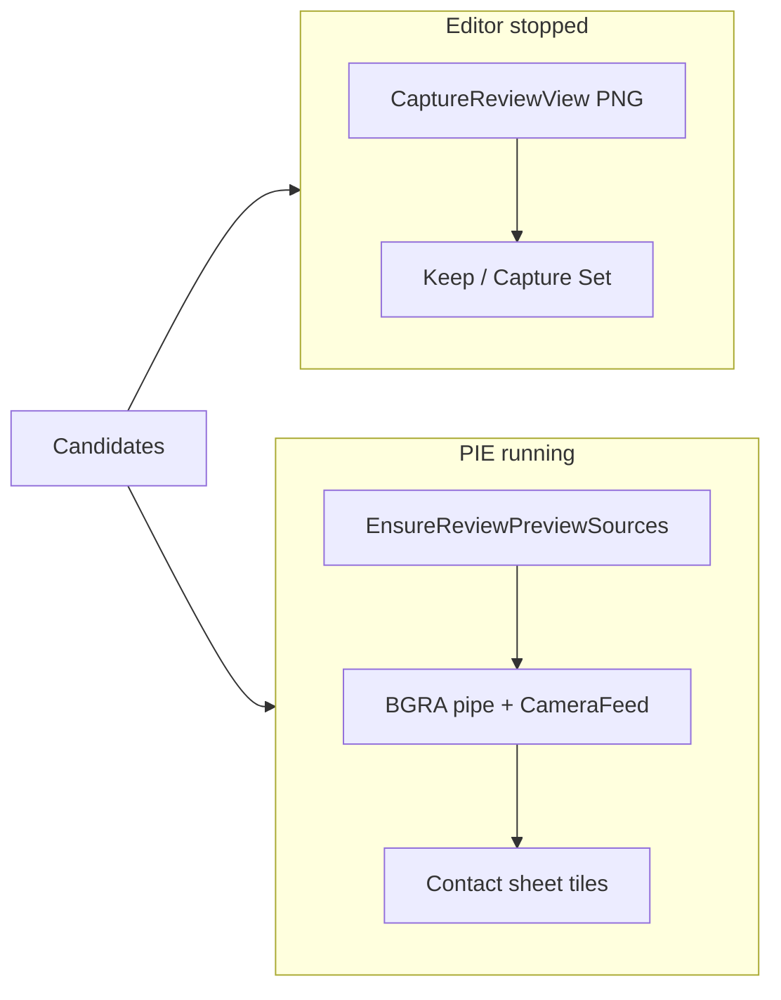

# Plan 018: PIE live cameras for Map Review authoring previews

> **Executor instructions**: Follow this plan in order. Run each verification gate before moving
> to the next step. If a STOP condition occurs, stop and report it; do not broaden into live→durable
> promotion or editor-world live subsystems. Update this plan's status row in `plans/README.md`
> only after all done criteria pass.
>
> **Drift check (run first)**:
> `git diff --stat HEAD -- packages/cameras packages/protocol unreal/Plugins/UEShedCameras extensions/camera-review apps/workbench docs/products/map-review.md`
> If current code no longer matches the excerpts below, stop and reconcile before editing.

## Status

- **State**: DONE — PIE posed live BGRA previews, Clear without dirt, Camera Lab overview/actor_pov,
  capture-blocked-during-PIE, and no-rehydrate-on-select verified on UE 5.7 fixture
- **Priority**: P0
- **Effort**: L
- **Risk**: MED — touches the live camera subsystem used by Camera Lab; bad registration can leak
  actors into PIE, stomp fixture camera transforms, or starve the shared BGRA pipe.
- **Depends on**: none (complements 017; does not replace its PNG projection / session recovery gates)
- **Category**: direction
- **Planned at**: 2026-07-21

## Why this matters

Authoring contact-sheet previews currently call `CaptureReviewView` (transient SceneCapture → PNG on
disk → read bytes). That path is correct for durable Keep / Capture Set screenshots. It is the wrong
path for interactive previews: it is slow, serialized, and today every tile click re-triggers a full
sheet re-shoot via `persist → activate → hydratePreviews`.

The optimized live BGRA pipe already exists (ADR 0003 / Camera Load Lab). It is Game/PIE-only by
design. Map Review already wires PLAY/SIM, and durable capture is already blocked while a play
session is active (`evaluateReviewCapturePolicy`). Unlocking **runtime registration of posed live
sources during PIE** lets authoring previews use that pipe when PLAY is on, without making live
frames into durable evidence.

## Product rule (do not violate)

| Mode              | Authoring contact sheet                | Keep / Capture Set              |
| ----------------- | -------------------------------------- | ------------------------------- |
| Editor stopped    | PNG one-shot (`CaptureReviewView`)     | PNG durable path                |
| PIE / SIE playing | Live BGRA from transient posed sources | Still blocked (existing policy) |

Live frames are previews only. Promoting a live frame into a Capture Run is Slice 7 and out of scope.

## Current state

- `UUEShedCameraSubsystem::ShouldCreateSubsystem` only allows `PIE` or `Game` worlds.
- Tick discovers `AUEShedCameraSource` actors **once** when `Runtime->Cameras` is empty; mid-session
  spawns are ignored.
- `overview` mode restores each source to `OverviewTransform`, undoing manual moves.
- `packages/cameras/src/review-authoring-live.ts` `previewCandidate` always uses `captureReviewView`
  and reads a staging PNG.
- `extensions/camera-review/src/map-review-authoring.tsx` `activate` always calls `hydratePreviews`,
  including after selection patches.
- Fixture `L_CameraLoad` already places 32 sources (current schedule max `activeCameraCount` 32).

## Approach

### 1. Unreal: dynamic register + `posed` view mode

In `unreal/Plugins/UEShedCameras`:

1. Add register/unregister APIs on the subsystem that allocate dual readback slots for a source
   without requiring an empty camera list.
2. Extend schedule config with `viewMode: "posed"` (protocol + C++ parse). In `posed` mode, do
   **not** restore overview transforms and do not apply actor_pov offsets.
3. Add Remote Control callables (cameras library is fine if they resolve the PIE-world subsystem):
    - `EnsureReviewPreviewSources(RequestJson) → ResultJson` with camera descriptors
    - `ClearReviewPreviewSources()` that destroys only transient review sources and drops their slots
4. Mark review sources so PIE end / clear cannot leave map dirt. Prefer session-scoped **replace** of
   the active schedule bank while Map Review preview is bound (fixture sources remain in-world but
   are not scheduled), rather than exceeding the 32-cap blindly.
5. Camera Lab regression: with no review registration, discovery + `overview` / `actor_pov` behavior
   must remain unchanged.

### 2. TypeScript: dual preview port

In `packages/cameras` (+ protocol schema for `posed`):

1. Branch `ReviewAuthoring.previewCandidate` (or a sibling) on play-session state:
    - playing → ensure live sources, `configureCameras` with `viewMode: "posed"`, observation-friendly
      resolution (start at `640x360`), wait for latest frame(s) from `CameraFeed` keyed by `cameraId`
    - stopped → existing PNG `CaptureReviewView` path
2. Typed failure if PIE is active but no pipe host is listening (Workbench or other feed host), with
   recovery: start a feed host or stop PIE for PNG preview.
3. Keep / Capture Set unchanged: still PNG + existing capture policy.
4. Projection: PNG path keeps engine `subjectProjection` (plan 017). Live path may use pure
   projection from pose + subject bounds until a live side-channel exists — do not block this plan
   on engine projection for BGRA frames.

### 3. Workbench / extension UX

1. Stop calling `hydratePreviews` from selection `persist` success. Cache tile images.
2. Re-fetch only on generate/reframe, explicit refresh, or first empty preview.
3. When PLAY is active, bind tiles to live frame subscription (reuse Camera Lab decode / presentation
   patterns) keyed candidate → `cameraId`.
4. On play stop: clear live binding; keep last frame or fall back to PNG regenerate.

### 4. Docs

1. Add this plan to `plans/README.md` Active table.
2. Update `docs/products/map-review.md` delivery status: authoring previews are live-when-PIE,
   PNG-when-editor; durable evidence remains editor PNG. Note Slice 7 promote remains later.

## Verification gates

| Gate                  | Command / action                                                              | Pass                  |
| --------------------- | ----------------------------------------------------------------------------- | --------------------- |
| Protocol / typecheck  | `pnpm typecheck`                                                              | exit 0                |
| Unit                  | targeted vitest for schedule `posed`, preview branch, no re-hydrate on select | exit 0                |
| Camera Lab regression | Lab launch + configure overview still delivers frames                         | manual / existing e2e |
| PIE integration       | PLAY → Ensure sources for N candidates → frames on pipe → Clear on STOP       | exit 0 / manual       |
| Policy                | Capture Set still blocked during PIE                                          | unit + manual         |
| UI                    | click another tile does not re-shoot sheet; Reframe does                      | component / manual    |

## Done criteria

- [x] Transient posed sources can be registered and cleared during PIE without map dirt.
- [x] Authoring previews use live BGRA while PLAY is active and PNG while editor is stopped.
- [x] Tile click no longer re-captures the whole contact sheet.
- [x] Camera Lab overview/actor_pov path still healthy.
- [x] Docs + `plans/README.md` updated; this plan status → DONE and archived when gates pass.

## STOP conditions

- Enabling the live subsystem in the pure editor world (no PIE).
- Treating live frames as durable Capture Run evidence.
- Mutating durable Approved Pose / Capture Profile from live overrides.
- Breaking Camera Lab’s placed-camera discovery path to ship review previews.

## Out of scope

- Live→durable promote (Map Review Slice 7).
- Matching live observation fidelity to Pure PNG capture profiles.
- Atlas readback / further pipe throughput work beyond what’s needed for ~7 preview tiles.
